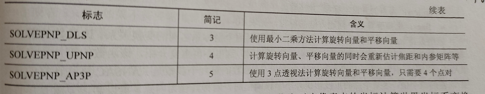

# 一. 数据载入、显示、保存

## 	1.1 Mat

### 	1.0.0 

​	Mat包括 矩阵头、矩阵指针
​		矩阵头: 矩阵尺寸、储存方法、地址引用次数

​	可以储存
​		CV_8U          8位无符号
​		CV_8S	      8位有符号
​		CV_16U       16位无
​		CV_16S       16有
​		CV_32S       32有
​		CV_32F       32浮点数 
​		CV_64F       64浮点数

```c++
cv::Mat a(640, 480, CV_8UC3)  // 640*480 3通道矩阵
```

###       		1.1.1 构造

```c++
cv::Mat a = Mat_<double>(3, 3);  // 声明指定类型
cv::Mat::Mat();  // 默认, 会在后续自动判断类型、大小，用于存储读取的图像数据、函数输出结果
cv::Mat::Mat(int rows, int cols, int type);  // 行 列  数据类型CV_8UC3
cv::Mat::Mat(Size size(), int type);  // 二维数组变量尺寸 Size(cols, rows);
/**
 * m: 已经构建完成的Mat矩阵
 * rowRange: Range(2, 5)第2行到第5行 
 * colRange: Range(2, 5)第2列到第5列
 *
 * 指向的数据仍一致(?)
 */
cv::Mat::Mat(const Mat & m);  // 利用已有Mat。只是复制了矩阵头，改变其中一个另一个也会改变
cv::Mat::Mat(const Mat & m, const Range & rowRange, const Range & colRange);  // 构造已有Mat类的子类

// 对Mat图像切片
inline
Mat Mat::operator()( const Rect& roi ) const
{
    return Mat(*this, roi);
}
Rect rect(100, 100, 300, 300);  //Rect(x, y, 矩形宽, 矩形高);
src1(rect) = Scalar(255, 255, 255);  //生成一个低通300*300的掩模

Size(cols, rows);
```

###      	 	1.1.2 赋值

```c++
/**
 * rows: 行y
 * cols: 列x
 * type: 数据类型
 * s: 每个像素赋值的参数变量 如: Scalar(0, 0, 255)
**/
cv::Mat::Mat(int rows, int cols, int type, const Scalar & s);  // 构造并赋值

cv::Mat a = (cv::Mat_<int>(3, 3) << 1, 2, 3, 4, 5, 6, 7, 8, 9);  // 枚举法赋值
// 循环法
cv::Mat b = cv::Mat_<int>(3, 3);
for (int i = 0; i < b.rows; i++)
{
    for (int j = 0; j < b.cols; j++)
    {
        c.at<int>(i, j) = one_int;
    }
}
// 类方法
cv::Mat a = (cv::Mat_<int>(1, 3)  << 1, 2, 3);
cv::Mat b = cv::Mat::eye(3, 3, CV_8UC1);  // 
cv::Mat c = cv::Mat::diag(b);  // 参数必须位Mat一维变量，对角矩阵
cv::Mat d = cv::Mat::ones(3, 3, CV_8UC1);  // 单位矩阵，都为1(?)
cv::Mat e = cv::Mat::ones(4, 3, CV_8UC3);  // 全为0
Mat m; m.create(int rows, int cols, int type);
// 数组
float arr[8] = {1,2,3,4,5,6,7,8};
cv::Mat b = cv::Mat(2, 4, CV_32FC2, arr);

Scalar(0, 0, 255); 每个像素赋值的参数变量; 
```

###     	  	1.1.3 运算

```
+ - :  数据类型相同;
* / :  a.cols == b.rows, 必须是CV_32FC1, CV_32FC2, CV_64FC1, CV_64FC2;
a.dot(b) 内积: 
a.mul(b) 对应位的乘积
```

###       		1.1.4 读取Mat

```c++
/**
 * @ resume: 属性 
 * cols 列y
 * rows 行x
 * step 以字节为单位的矩阵的有效长度
 * elemSize() 每个元素的字节数
 * total() 矩阵中每个元素的个数
 * channels() 矩阵中的通道数
**/
// at
cv::Mat a = (cv::Mat_<uchar>(3, 3) << 1,2,3,4,5,6,7,8,9);
int value = (int)a.at<uchar>(0,0);  // 单通道。如果数据类型为uchar输出该数据时要转换为int
cv::Mat b = (3,4, CV_8UC3, cv::Scalar(0,0,1));  // 多通道
cv::Vec3b vc3 = b.at<cv::Vec3b>(0,0);  // Vec3b-uchar, s-short, w-ushort, d-double, f-float, i-int
int first = (int)vc3.val[0];
int second = (int)vc3.val[1];
int third = (int)vc3.val[2];
// ptr
cv::Mat b(3,4,CV_8UC3,cv::Scalar(0,0,1));
for (int i = 0; i < b.rows; i++)
{
    uchar* ptr = b.ptr<uchar>[i];
    for (int j = 0; j < b.cols * b.channels; j++)
    {
        cout << (int)ptr[j] << endl;
    }
}
// 或
b.ptr(1)[2];
// 迭代器
cv::MatIterator_<uchar> it = a.begin<uchar>();
cv::MatIterator_<uchar> it_end = a.end<uchar>();
for (int i = 0; it != it_end; i++)
{
    cout << (int)(*it) << " ";
    if ( (++i % a.cols) == 0 )
        cout << endl;
}
// 矩阵元素的地址定位
(int)( *(b.data + b.step[0]*行row + b.step[1]*列col + 通道数channel) );


```

## 	1.2图像的读取、显示

###       		1.2.1 imread

```c++
/**
 * filename: 文件名
 * flags: 标志.  默认值为按彩图读取 P38            
 * 当文件打开失败 返回空矩阵
 */
cv::Mat cv::imread(const String & filename, int flags=IMREAD_COLOR);  // 读取图像

a.data 数据
a.empty();  // 是否为空，空为True
```


###      	 	1.2.2 namedWindow

```c++
void cv::namedWindow(const String & winname, int flags = WINDOW_AUTOSIZE);  // 创建窗口 P39
void cv::destroyWindow(const String & winname);  // 关闭指定窗口
void cv::destroyAllWindow();  // 关闭所有窗口
```


###       		1.2.3 imshow

```c++
void cv::imshow(const String & winname, InputArray mat);  // 显示图像
```

## 	1.3 视频加载与摄像头调用(VideoCapture类)

###       		1.3.1视频数据读取

```c++
/**
 * filename: 视频文件、图像序列(%02d.jpg)、URL 
 * apiPreference: 设置的属性, 如: 编码，是否调用OpenNI....
 **/
cv::VideoCapture::VideoCapture();  // 默认构造, 之后需要调用 open();
cv::VideoCapture::VideoCapture(const String & filename, int apiPreference = CAP_ANY);  // 

处理视频内容时仍需 >> Mat
while (1)
{
    Mat m;
    video >> m;
    if (m.empty())
        break;
    imshow("video", frame);
    waitKey(1000 / v.get(CAP_PROP_FPS));
}
    
isOpened();  // 成功 1
v.get(int flags);  // P41
```


###       		1.3.2摄像头直接调用

```c++
cv::VideoCapture::VideoCapture(int index, int apiPreference=CAP_ANY);
/**
 * index: 摄像头设备ID
 * apiPreference: api首选项
 *
**/
```

## 	1.4数据保存

###      	 	1.4.1图像

```c++
bool cv::imwrite(const String & filename, InputArray img, 
                 const std::vector<int> & params = std::vector<int>());
/**
 * @resume: 通常只能保存: 8位单通道
                        3通道BGR
            另: CV_16U: png, jpeg, tiff;
                CV_32F: ...;
                四通道: png;
 * filename: 
 * params: 属性设置标志  P44
 * 	设置方法:
 		vector <int> p;
 		p.push_back(IMWRITE_JPEG_QUALITY);
 		p.push_back(....................);
 		imwrite(filename, img, p);
 * @return: 成功 1
 */
```


###       		1.4.2视频

```c++
cv::VideoWriter::VideoWriter();  // 默认构造函数. 后续open()
cv::VideoWriter::VideoWriter(const String & filename, 
                             int fourcc, // 压缩帧的4字符编解码器代码
                             double fps,  // 保存视频的帧数
                             Size frameSize, // frameSize: 视频帧的尺寸, 一定要与原视频相同
                             bool isColor=True);  // 是否为彩色
/**
 * fourcc: 压缩帧的4字符编解码器代码 -1 自动设置 .P46
 * fps: 保存视频的帧数
 * frameSize: 视频帧的尺寸, 一定要与原视频相同
 * isColor: 是否为彩色
 */
```

###       		1.4.3 XML、YXML

P47

# 二.图像基本操作

##   2.1颜色空间

​	RGB.
​	HSV:  Hue 色度  Saturation 饱和度  Value  亮度
​	Lab:  L 亮度  a绿色->红色 b蓝色->黄+色  颜色通道， 有负数，不能用imshow，要用插件显示
​	YUV: Y 亮度, U 红色分量与亮度信号差值, V 蓝色与亮度的差值
​				Y = 0.299R + 0.587G + 0.114B
​	GRAY: 灰度图像模型

### 	     	2.1.1颜色模型与转换

```c++
void cv::cvColor(InputArray src, OutputArray dst, int code, int dstCn=0);  // 颜色模型转化
/**
 * code: 转换标识  P57
 * dstCn: 目标图像dst中的通道数. =0 会在函数中自动推导
 * 要注意目标图像的像素范围，适当进行归一化
**/ 

void cv::Mat::convertTo(OutputArray m, int rtype, double alpha=1, double beta=0)  // 数据类型转换
/**
 * rtype: 转换后图像的数据类型
 * alpha: 转换过程中的缩放因子
 * beta: 转换过程中的偏置因子
 * P59
**/
```


### 	     	2.1.2通道分离、合并

```c++
void cv::split(const Mat & src, Mat* mvbegin);  // 分离
void cv::split(InputArray m, OutputArrayOfArrays mv);  // 分离
/**
 * mvbegin: 分离后的单通道图像，为数组形式，且大小与src通道数相同
 *
 * mv: 分离后的单通道图像，为 向量vector 类型: vector<Mat>
**/

void cv::merge(const Mat* mv, size_t count, OutputArray dst);  // 合并
void cv::merge(InputArrayOfArrays mv, OutputArray dst);  // 合并
/**
 * mv: 需要合并的图像数组  要有相同的尺寸、数据类型
 * count: 输入的图像数组的长度, >0
 * 
 * mv: 需要合并的图像的向量 vector  要有相同的尺寸、数据类型
 * dst: 输出 与mv[0]有相同的尺寸、数据类型, 通道数=输入的所有图像的通道总和
**/
Mat cv::Mat::reshape(int cn, int rows);  // 调整通道、矩阵行数
/**
 * cn: 转换后矩阵的通道数, =0,则与原来相同
 * rows: 转换后矩阵的行数, =0,则与原来相同
**/
```

##   2.2图像像素操作

### 	     	2.2.1像素统计

```c++
void cv::minMaxLoc(InputArray src, // 单通道
                   double* minVal, double* maxVal=0, // 最小.大值
                   Point* minLoc = 0, Point* maxLoc = 0, // 最小.大值坐标
                   InputArray mask = noArray);  // 寻找图像像素最大、小值.
/**
 * src: 必须是单通道
 * minVal: 最小值
 * maxVal: 最大值
 * minLoc: 最小值在矩阵中的坐标
 * maxLoc: 最大值............
 * mask: 掩模. 用于设置在指定区域寻找
 * @note: P63
**/
cv::Scalar cv::mean(InputArray src, InputArray mast = noArray());  // 求取平均值
/**
 * src: 通道数1-4
 * mast: 掩模
 * @return: Scalar: 包含4个数据[0,0,0,0], 为每一通道的平均值. Scalar[0]; 可以整个输出
**/
void cv::meanStdDev(InputArray src, OutputArray mean, OutputArray stddev, 
                    InputArray mask = noArray());  // 求取标准差
/**
 * src: 通道数1-4
 * mean: 每个通道的平均值, 参数为Mat 
 * stddev: 每个通道的标准差, 参数为Mat 
 * mask: 掩模
**/
    
cv::Point(或cv::Point2i), cv::Point2d, cv::Point2f  // 二维坐标(x,y)或者理解为(列数,行数)
cv::Point3i, cv::Point3d, cv::Point3f  // 三维(x,y,z)
```

### 	     	2.2.2两图像之间的像素操作

```c++
void cv::max(InputArray src1, InputArray src2, OutputArray dst);  // 保留两幅图像中较大的灰度值
void cv::min(InputArray src1, InputArray src2, OutputArray dst);  // 保留两幅图像中较小的灰度值
/**
 * src1: 任意通道数
 * dst: 尺寸、通道数、数据类型一致=src1=src2
**/
// 可以配合掩模实现抠图
Mat src2 = Mat.zeros(Size(500, 500), cv_8UC3);  // weigth, heigth
Rect rect(100, 100, 300, 300);  // 定义矩形大小 Rect(x, y, 矩形宽, 矩形高);
src2(rect) = Scalar(255, 255, 255);  // 矩形区域像素设置为(255,255,255), 生成一个低通300*300的掩模
min(src1, src2, comsrc1);  // 因为255总为大，所以将图像扣出

void cv::bitwise_and(InputArray src1, InputArray src2, OutputArray dst, InputArray mask = noArray());  // 与
void cv::bitwise_or(InputArray src1, InputArray src2, OutputArray dst, InputArray mask = noArray());  // 或
void cv::bitwise_xor(InputArray src1, InputArray src2, OutputArray dst, InputArray mask = noArray());  // 异或
void cv::bitwise_not(InputArray src1, OutputArray dst, InputArray mask = noArray());  // 非
/**
 * src1: 可以是多通道，但多通道之间是独立进行的
 * src2: 尺寸、通道数、数据类型要一致
 * dst: 尺寸、通道数、数据类型与src1一致
 * mask: 掩模
**/
```

### 	     	2.2.3二值化

```c++
二值图像: 只有最大、最小值;
double cv::threshold(InputArray src, OutputArray dst, 
                     double thresh,// 二值化阈值 多为125
                     double maxval,// 二值化过程中最大值 多为255
                     int type //二值化方法. 后两种方法可以配合其他方法使用,且仅支持CV_8UC1,会自动推导thresh
                     );  // 二值化
/**
 * src: 只能是CV_8U、CV_32F, 通道数要求与二值化方法有关
 * dst: 尺寸、数据类型、通道数与输入图像一致
 * thresh: 二值化阈值
 * maxval: 二值化过程中最大值，只在THRESH_BINARY、THRESH_BINARY_INY中使用
 * type: 二值化方法 P71
 * 
**/
void cv::adaptiveThreshold(InputArray src, OutputArray dst, 
                           double maxValue, // 二值化的最大值
                           int adaptiveMethod, // 自适应确定阈值方法
                           int thresholdType,  // 二值化方法标志
                           int blockSize, // 自适应确定阈值的像素邻域大小
                           double c  // 从平均值/加权平均中 减去的常数
                          );  // 有两种自适应阈值的二值化
/**
 * src: 只能是CV_8UC1
 * dst: 尺寸、数据类型、通道数与输入图像一致
 * maxValue: 二值化的最大值
 * adaptiveMethod: 自适应确定阈值方法，均值法: ADAPTIVE_THRESH_MEAN_C,高斯法: ADAPTIVE_THRESH_GAUSSIAN_C
 * thresholdType: 二值化方法标志. 只能 THRESH_BINARY、THRESH_BINARY_INY
 * blockSize: 自适应确定阈值的像素邻域大小, 一般为奇数
 * C: 从平均值/加权平均中 减去的常数, 可正可负
 *
**/

// 加
void inRange(InputArray src,
             InputArray lowerb, InputArray upperb, 
             OutputArray dst);
/*
 * 参数1：输入要处理的图像，可以为单通道或多通道。
 * 参数2：包含下边界的数组或标量。
 * 参数3：包含上边界数组或标量。
 * 参数4：输出图像，与输入图像src 尺寸相同且为CV_8U 类型
 *
 * HSV:  lower = Scalar(35, 0, 0)
         upper = Scalar(120, 255, 255)
*/


```


### 	     	2.2.4LUT

需要多个阈值时LUT: Look-Up-Table:显示查找表。是一个映射(理解为python中的字典)

```c++
void cv::LUT(InputArray src, InputArray lut, OutputArray dst);  // 
/**
 * src: 只能是CV_8U, 可以是多通道
 * lut: 256个像素灰度值查找表，单通道(此时src每个通道都按这个映射)/与src通道数相同
 * dst: 尺寸=src, 数据类型=lut
**/
// lut参数使用
vector<Mat> vm;
vm.push_back(lut_0);
vm.push_back(lut_1);
vm.push_back(lut_2);
```

##   2.3图像变化

### 	     	2.3.1连接

```c++
void cv::vconcat(const Mat* src, size_t nsrc, OutputArray dst);  // 上下连接
/**
 * src: Mat数组
 * nsrc: 数组数目
 * dst: 
**/
void cv::vconcat(InputArray src1, InputArray src2, OutputArray dst);  // 上下连接，两个
/**
 * src1: Mat矩阵
 * src2: Mat矩阵, 相同宽度、数据类型、通道数
 * dst: 
**/
void cv::hconcat(const Mat* src, size_t nsrc, OutputArray dst);  // 左右连接
/**
 * src: 数组
 * nsrc: 数目
 * dst: 
**/
void cv::hconcat(InputArray src1, InputArray src2, OutputArray dst);  // 左右连接, 两个
/**
 * src1: Mat矩阵
 * src2: Mat矩阵, 相同宽度、数据类型、通道数
 * dst: 
**/
```

### 	     	2.3.2尺寸变换

```c++
void cv::resize(InputArray src, OutputArray dst, 
                Size dsize,
                double fx=0, double fy=0,
                int interpolation=INTER_LINEAR);  // 修改尺寸
/**
 * dst: 与src数据相同
 * dsize: 输出图像的尺寸(与fx,fy作用相同, 二者都有以dsize为准);Size()为空
 * fx: 水平轴的比例因子
 * fy: 垂直轴的比例因子
 * interpolation: 插入方法的标志  P82
**/
```


### 	     	2.3.3翻转

```c++
void cv::flip(InputArray src, OutputArray dst, int flipCode);  // 翻转
/**	
 * flipCoode: >0, 绕Y轴;
              =0, 绕X轴; 
              <0, 绕两个轴
**/ 
```

### 	     	2.3.4仿射

可理解为旋转、平移、缩放的统称

```c++
Mat cv::getRotationMatrix2D(Point2f center, double angle, double scale);  // 计算旋转矩阵
/**
 * center: 图像旋转中心位置
 * angle: 旋转的角度, 单位为度, 正值为逆时针
 * scale: 缩放因子, =1, 不缩放
 * @return: 旋转后的矩阵. 是2x3矩阵
 * 公式: P85
**/
Mat cv::getAffineTransform(const Point2f src[], const Point2f dst[]);  // 利用三个像素点确定变换矩阵
/**
 * 利用三个像素点确定变换矩阵
 *
 * src[]: 源图像的3个像素坐标
 * dst[]: 目标图像的3个像素坐标, 要一一对应
 * @return: 2x3变换矩阵矩阵
**/
void cv::warpAffine(InputArray src, OutputArray dst, 
                    InputArray M, Size dsize, 
                    int flags = INTER_LINEAR, int borderMode = BORDER_CONSTANT,
                    const Scalar& borderValue = Scalar());  // 仿射变换
/**
 * 仿射变换 
 *
 * src
 * dst: 数据类型=src, 尺寸=dsize
 * M: 2x3矩阵
 * dsize: 输出图像尺寸
 * flags: 插值方法标志 P86
 * borderMode: 像素边界外推方法标志 P86
 * borderValue: 填充边界使用的数值. 默认=0;
**/
```


### 	     	2.3.5透视

​	透视前后可以用3x3矩阵表示, 可以通过4个对应点的坐标求，因此又称“四点变换”

```c++
Mat cv::getPerspectiveTransform(const Point2f src[], const Point2f dst[], 
                                int solveMethod = DECOMP_LU);  // 求取变换矩阵
/**
 * src[]: 原图像中4个点坐标 浮点数
 * dst[]: 目标...........  浮点数
 * solveMethod: 透视计算方法标志 P88
 * @return: 3x3矩阵
**/
void cv::warpPerspective(InputArray src, OutputArray dst, InputArray M, Size dsize, 
                        int flags = INTER_LINEAR, int borderMode = BORDER_CONSTANT
                        const Scalar & borderValue = Scalar());  // 透视变换
/**
 * src: 
 * dst: 数据类型=src, 尺寸=dsize
 * M: 3x3矩阵  变换矩阵
 * dsize: 输出图像尺寸
 * flags: 插入方法标志 P86
 * borderMode: 像素边界外推方法的标志 P86
 * borderValue: 填充外界使用的数值, 默认=0
 *
**/
```


### 	     	2.3.6极坐标变换

​	直角坐标与极坐标之间相互转换。
​	可以将圆形变为矩形，常用于处理钟表、圆盘，变换为矩形，便于文字处理

```c++
void cv::warpPolar(InputArray src, OutputArray dst, 
                   Size dsize, //目标图像的大小
                   Point2f center //极坐标的原点坐标
                   double maxRadius, int flags);  // 实现图像的极坐标变换
/**
 * src: 可以是灰度、彩色图
 * dst: 数据类型、通道数=src
 * dsize: 目标图像的大小
 * center: 极坐标变换时极坐标的原点坐标
 * maxRadius: 变换时边界圆的半径，也决定逆变换时的比例参数
 * flags: 差值方法、极坐标映射方法 P91
**/
WARP_POLAR_LINEAR    极坐标变换
WARP_POLAR_LOG       半对数极坐标变换
WARP_POLAR_MAP       逆变换
```

##   2.4在图像上绘制几何图

### 	     	2.4.1圆

```c++
void cv::circle(InputOutputArray img, 
                Point center /*圆心*/, 
                int radius /*半径*/, 
                const Scalar & color /*颜色*/, 
                int thickness=1/*轮廓宽度*/, 
                int lineType=LINE_8, int shift=0);  // 绘制圆
/**
 * img: 
 * center: 圆心坐标
 * radius: 半径, 单位: 像素
 * color: 颜色
 * thickness: 轮廓宽度.  <0, 绘制实心圆
 * lineType: 边界类型. 可取: FILLED、LINE_4、LINE_8、LINE_AA
 * shift: 中心坐标、半径数值中的小数位数
**/
```

### 	     	2.4.2直线

```c++
void cv::line(InputOutputArray img, 
              Point pt1, Point pt2,  /*起点终点*/
              const Scalar & color, /*颜色*/
              int thickness= 1, int lineType=LINE_8, int shift=0);  // 绘制直线
/**
 * pt1: 直线起点坐标
 * pt2: 直线终点坐标
 * color: 直线的颜色, 三通道表示
**/
```

### 	     	2.4.3椭圆

```c++
void cv::ellipse(InputOutputArray img, 
                 Point center, /*椭圆中心*/
                 Size axes, /*主轴大小的一半*/
                 double angle, /*旋转角度*/
                 double startAngle, double endAngle, /*弧的起始终止角度*/ 
                 const Scalar & color, /*颜色*/
                 int thickness=1, int lineType=LINE_8, int shift=0);  // 绘制椭圆
/**
 * center: 椭圆的中心坐标
 * axes: 主轴大小的一半
 * angle: 椭圆旋转的角度, 单位: 度
 * startAngle: 椭圆弧起始的角度
 * endAngle: 椭圆弧的终止角度
 * thickness: 轮廓宽度.  <0, 绘制实心椭圆
**/
void cv::ellipse2Poly(Point center, Size axes, int angle,
                      int arcStart, int arcEnd, int delta, std::vector<Point> & pts);  
// 输出椭圆边界的像素坐标
/**
 * delta: 后续折线顶点之间的角度，定义了近似精度
 * pts: 椭圆边缘像素坐标向量集合
**/
```

### 	     	2.4.5多边形

```c++
void cv::rectangle(InputOutputArray img, 
                   Point pt1, Point pt2, /*相对的两个点*/
                   const Scalar & color,
                   int thickness=1, int lineType=LINE_8, int shift=0);  // 绘制矩形
void cv::rectangle(InputOutputArray img, 
                   Rect rec, /*(左上顶点)x、y、宽、高*/
                   const Scalar & color,
                  int thickness=1, int lineType=LINE_8, int shift=0);  // 绘制矩形
/**
 * pt1: 矩形的一个顶点
 * pt2: pt1相对的顶点
 *
 * rec: 矩形左上角顶点、长、宽
**/
Rect(x, y, 矩形宽, 矩形高);
分为 Rect2i(Rect), Rect2d, Rect2f
    
void cv::fillPoly(InputOutputArray img, 
                  const Point** pts, const int* npts,/*顶点数组及点的个数*/
                  int ncontours,  /*绘制数目*/
                  const Scalar & color, /*颜色*/
                  int lineType=LINE_8, int shift=0, Point offset=Point());  // 绘制多边形
/**
 * pts: 多边形顶点数组. 可以存放多个多边形顶点坐标数组. 要按顺时针/逆时针顺序给出
 * npts: 每个多边形顶点数组中顶点的个数
 * ncontours: 绘制多边形的个数
 * offset: 所有顶点的可选偏移
**/
```

### 	     	2.4.6文字

```c++
void cv::putText(InputOutputArray img, 
                 const String & text,  /*文本*/
                 Point org, /*左下角像素坐标*/
                 int fontFace, /*字体类型 P95*/
                 double fontScale, /*字体大小*/
                 Scalar color, /*颜色*/
                 int thickness=1, int lineType=LINE_8, bool bottomLeftOrigin=false);  // 文字
/**
 * text: 目前只能为英文(显示中文要自行添加依赖项)
 * org: 文字字符串左下角像素坐标
 * fontFace: 字体类型选择标志 P95
 * fontScale: 字体大小
 * bottomLeftOrigin: 图像数据原点的位置. 默认false: 左上角. =true, 左下角
**/


```


##   2.5感兴趣区域(ROI-Region Of Interest)

用Range或Rect标记

```c++
Rect(_Tp _x, _Tp _y, _Tp _width, _Tp _height);  // 用Rect标记
cv::Range(int start, int end);  // 用Range标记
/**
 * _Tp: 模板类型
 * _x: 矩形左上角第一个像素的X坐标. 即第一个像素的列数
 * _y: y. 行数
 * _width: 矩形宽. 即, 跨越的列数
 * _height: 高. 行数
 * 
 * start: 区间起始
 * end: 结束
**/

rect.area();     //返回rect的面积 5000
rect.size();     //返回rect的尺寸 [50 × 100]
rect.tl();       //返回rect的左上顶点的坐标 [100, 50]
rect.br();       //返回rect的右下顶点的坐标 [150, 150]
rect.width();    //返回rect的宽度 50
rect.height();   //返回rect的高度 100
rect.contains(Point(x, y));  //返回布尔变量，判断rect是否包含Point(x, y)点

如: 对于图像Mat-img
img(Rect(p.x, p.y, width, height));
img(Range(rows_y_start, rows_y_end), Range(cols_x_start, cols_x_end));/**/

void cv::Mat::copyTo(OutputArray m) const;  // 深度复制
void cv::Mat::copyTo(OutputArray m, InputArray mask) const;  // 深度复制
void cv::copyTo(InputArray src, OutputArray dst, InputArray mask);  // 深度复制
Mat a = b.clone();
/**
 * OutputArray 与原图像有相同尺寸、数据类型
 * mask: 只能是CV_8U, 尺寸相同，通道数可以不同. 掩模中: =0 复制, !=0 不复制
**/
```

##   2.6图像金字塔

### 	     	2.6.1高斯金字塔

底层为原图，往上为下采样结果

```c++
void cv::pyrDown(InputArray src, OutputArray dst, 
                 const Size & dstsize=Size(),
                 int borderType=BORDER_DEFAULT);  // 下采样
/**
 * src: 
 * dst: 数据类型、通道数=src
 * dstsize: 输出图像尺寸. 默认为原图的一半. 应满足| dstsize.width2(height2) - src.cols(rows) | <= 2
 * borderType: 外推法标志 P3-5
**/
```

### 	     	2.6.2拉普拉斯金字塔

先对src下采样再上采样得到a，然后求取a与src的差值

```c++
void cv::pyrUp(InputArray src, OutputArray dst, const Size & dstsize=Size(),
                int borderType=BORDER_DEFAULT);  // 下采样
/**
 * src: 
 * dst: 数据类型、通道数=src
 * dstsize: 输出图像尺寸. 默认为原图的一半. | dstsize.width2(height2) - src.cols(rows) | <= 2
 * borderType: 外推法标志 P3-5
**/
```

##   2.7图像交互操作

### 	     	2.7.1窗口滑动条

```c++
int cv::createTrackbar(const String & trackbarname, const String & winname, 
                      int* value, int count, TrackbarCallback onChange=0,
                      void* userdata=0);  //   创建滑动条
/**
 * trackbarname: 滑动条名称
 * winname: 窗口名称
 * value: 反映滑块的位置
 * count: 滑动条最大值
 * onChange: 每次滑动条位置改变时调用的函数指针. void Foo(int 轨迹栏位置, void* 用户数据↙).
 * userdata: 传递给回调函数的可选参数                                               ← 
**/
```

### 	     	2.7.2鼠标响应

```c++
void cv::setMouseCallback(const String& winname, MouseCallback onMouse, void* userdata=0);  //鼠标响应
typedef void(* cv::MouseCallback)(int event, int x, int y, int flags, void* userdata);  // 回调函数
/**
 * winname: 
 * onMouse: 鼠标响应的回调函数
 * userdata: 传递给回调函数的可选参数
 * 
 * event: 鼠标响应事件标志 P106
 * x: 鼠标X
 * y: 鼠标Y
 * flags: 鼠标响应标志 P107
 * userdata: ....
**/
```

  

# 三.图像直方图与模板匹配

##   3.1直方图绘制

x: 灰度值 y: 该灰度值的个数/该灰度值所占比例

```c++
void cv::calcHist(const Mat* images, 
                  int nimages, const int* channels,/*输入数量,通道索引(数组)*/
                  InputArray mask,/*掩码*/
                  OutputArray hist,
                  int dims, const int* histSize,/*维度,每个维度直方图的数组的尺寸**/
                  const float** ranges,/*灰度值的取值范围*/
                  bool uniform=true, bool accumulate=false);  // 统计灰度值数目
/**
 * 要先转化为灰度图
 * Input：图像数组、图像数量、通道索引(数组)、  掩码
 * Output：直方图结果、直方图维度、每个维度直方图的数组的尺寸、每个图像通道中灰度值的取值范围
 * calcHist(&gray,    1,     [0],   Mat(),out, 1,   [256], [ [0，256] ])
 * calcHist(images,nimages,channels,mask,hist,dims,histSize,ranges)
 *
 * channels: 0->images[0].channels()-1, images[0].channels()->images[0].channels() + images[1].channels()-1
 *
 *Point(width*(i - 1), hist_h - 1),
  Point(width*i - 1, hist_h - cvRound(hist.at<float>(i - 1) / 15)),
 *
 * images: 图像数组. 尺寸、数据类型相同，通道数可以不同, 只能为CV_8U, CV_16U, CV_32F,
 * nimages: 输入的图像的数量
 * channels: 需要统计的通道索引数组
 * mask: 操作掩码. 为空: 所有都记. 不为空: 数据类型=src=CV_8U
 * hist: 输出: 统计的直方图结果, dims维度的数组
 * dims: 需要计算直方图的维度(整数), <= CV_MAX_DIMS
 * histSize: 存放每个维度直方图的数组的尺寸.(像素灰度值的最大值(?))
 * ranges: 每个图像通道中灰度值的取值范围
 * uniform: 直方图是否均匀的标识符. 默认: 均匀(true)
 * accumulate: 是true否false累计统计
 **/

int cvRound(double );  // 四舍五入取整, 返回值为结果 
```

##   3.2直方图操作

### 	     	3.2.1归一化

有两种方式: 每个灰度值像素的数目/总像素数
			        所有结果除以找到的最大值

```c++
void cv::normalize(InputArray src, InputOutputArray dst, double alpha=1,
                  double beta=0, int norm_type=NORM_L2, int dtype=-1,
                  InputArray mask=noArray());  // 归一化
/**
 * src:
 * dst: 与src相同大小. 数据类型为CV_32F(?)
 * alpha: 范围归一化时，归一化到下限边界的标准值
 * beta: 范围归一化时的上线范围，不用于标准规范化
 * norm_type: 归一化中数据范数种类标志 P114
 * dtype: 输出 数据类型选择. <0, 数据类型=src
 * mask: 掩码矩阵
**/
```


### 	     	3.2.2比较

```c++
double cv::compareHist(InputArray H1, InputArray H2, int method);  // 比较直方图相似性
/**
 * H1: 第一幅图像的直方图
 * H2:  .二.............. 归一化方法、尺寸 要一致，
 * method: 比较方法标志 P117
 * @return: 相似度系数
**/
P117
/*
HISTCMP_CORREL          =1完全一致，=0完全不相关             0
HISTCMP_CHISQR          =0完全一致，数值越大相似性越小        1
HISTCMP_INTERSECT       数值越大越相似                       2
HISTCMP_BHATTACHARYYA   =0完全一致，数值越大相似性越小        3
HISTCMP_CHISQR_ALT      =0完全一致，数值越大相似性越小        4
HISTCMP_KL_DIV          =0完全一致，数值越大相似性越小        5
*/
```

##   3.3直方图的应用

### 	     	3.3.1均衡化

均衡化: 增加原来两个灰度值之间的差值

```c++
void cv::equalizeHist(InputArray src, OutputArray dst);  // 均衡化
/**
 * src: CV_8UC1
 * dst: 尺寸、数据类型=src
**/ 
```

### 	     	3.3.2匹配

将直方图映射成指定形式的算法称为----直方图匹配/直方图规定化(特定化的均衡化)
累计概率: <=某一灰度值的像素数目  占  所有像素的比例

```c++
// 通过构建差值表

// 计算两幅图的累积概率
float h1_cdf[256] = { h1.at<float>(0) };
float h2_cdf[256] = { h2.at<float>(0) };
for (int i = 1; i < 256; i++)
{
    h1_cdf[i] = h1[i - 1] + h1.at<float>(i);
    h2_cdf[i] = h2[i - 1] + h2.at<float>(i);
}
// 构建累积概率误差矩阵
float diff_cdf[256][256];
for (int i = 0; i < 256; i++)
{
    for (int j = 0; j < 256; j++)
    {
        diff_cdf[i][j] = fabs(h1_cdf[i] - h2_cdf[j]);
    }
}
//生成LUT映射表
Mat lut(1, 256, CV_8U);
for (int i = 0; i < 256; i++)
{
    // 查找源灰度级为i的映射灰度
    //　和i的累积概率差值最小的规定化灰度
    float min = diff_cdf[i][0];
    int index = 0;
    //寻找累积概率误差矩阵中每一行中的最小值
    for (int j = 1; j < 256; j++)
    {
        if (min > diff_cdf[i][j])
        {
            min = diff_cdf[i][j];
            index = j;
        }
    }
    lut.at<uchar>(i) = (uchar)index;
}
Mat result, hist3;
LUT(img1, lut, result);
```

### 	     	3.3.3 反向投影

```c++
void cv::calcBackProject(const Mat* images, int nimages, const int* channels,
                        InputArray hist, OutputArray backProject,
                        const float** ranges,
                        double scale = 1, bool uniform = true);  // 对图像直方图反向映射
/**
 * images: 直方图数组. 数据类型、尺寸相同, 通道数可以不同, 只能CV_8U,CV_16U,CV_32F
 * nimages: 直方图数量
 * channels: 通道索引数组
 * hist: 输入直方图
 * backProject: 反向投影图像. 尺寸、数据类型=iamges[0], 单通道
 * ranges: 每个通道中灰度值的取值范围
 * scale: 输出时的 比例因子
 * unifor: 直方图是否均匀的标识符. 默认: 均匀(true)
 * 
 * 1. 加载 模板图像、带反射投影图
 * 2. 转换颜色空间 ->GRAY(灰度图)/HSV
 * 3. 计算 模板图像直方图. GRAY(灰度)为一维，HSV为二维
 * 4. 带反向投影图、模板图的 直方图    赋值给   calcBackProject()
 *
 *	HSV
 	int h_bins = 32; int s_bins = 32;
 	//H通道值的范围由0到179
	float h_ranges[] = { 0, 180 };
	//S通道值的范围由0到255
	float s_ranges[] = { 0, 256 };
	int channels[] = { 0, 1 };  //统计的通道索引
**/
```

##   3.4模板匹配

通过灰度值来寻找相同内容的方法

```c++
void cv::matchTemplate(InputArray image, InputArray templ, OutputArray result,
                      int method, InputArray mask = noArray());  // 模板匹配
/**
 * image: CV_8U, CV_32F
 * templ: 模板图像. 数据类型=src, 尺寸 <= src
 * result: 输出 CV_32F. 单通道
 * method: 模板匹配方法 P128
 * mask: 掩码. 数据类型、尺寸=src. 默认不设置. 仅在TM_SQDIFF, TM_NORMED使用
 * 支持 灰度、彩色
 *
**/
```

​    TM_SQDIFF                                                                             0                平方差匹配法


TM_SQDIFF:  完全匹配 0.  数值越大, 匹配度越低
TM_SQDIFF_NORMED: 完全匹配 0. 数值越大, 匹配度越低
TM_CCORR: 数值越大, 匹配度越高
TM_CCORR_NORMED: 0~1. 1: 完全匹配，0: 完全不匹配
TM_CCOEFF: 数值越大, 匹配度越高. 可为负数
TM_CCOEFF_NORMED: 1~-1.  1: 完全匹配.  -1: 完全不匹配

# 四.图像滤波

##   4.1卷积

注意: 要将模板旋转180°.
	     数据可能越界, 要先进行归一化, 如 Mat / 12
   	  会使图像模糊

```c++
void cv::filter2D(InputArray src,
                  OutputArray dst, int ddepth,
                  InoutArray kernel, Point anchor = Point(-1, -1), 
                  double delta = 0, int borderType = BORDER_DEFAULT);  // 卷积
/**
 * src: 允许多通道. 对每个通道都是同一个卷积核. 也可分离split()出各个通道分别进行
 * dst: 尺寸、通道数=src
 * ddepth: 输出图像的数据类型. =-1, 自动选择
 * kernel: 卷积核, CV_32FC1. 奇数模板3x3,5x5...
 * anchor: 内核基准点(锚点). 默认: (-1,-1):kernel中心
 * delta: 对计算结果的偏值. 
 * borderType: 外推法. 
**/
```

##   4.2噪声的种类、生成

### 	     	4.2.1椒盐噪声

随机

```c++
// 随机函数
int cvflann::rand();
double cvflann::rand_double(double high=1.0, double low=0);
int cvflann::rand_int(int high=RAND_MAX, int low=0);  
```

### 	     	4.2.2高斯噪声

噪声概率密度函数服从高斯分布(正态分布)

```c++
void cv::RNG::fill(InputOutputArray mat, int distType, InputArray a, InputArray b, 
                  bool saturateRange=false);  // 产生均匀分布/正态分布的随机数
/**
 * mat: 用于存放随机数. 通道数<5
 * distType: 分布形式选择标志. 均匀(0/RNG::UNIFORM)正态(1/RNG::NORMAL)
 * a: 均匀分布: 最小下限. 高斯分布: 均值
 * b: 均匀分布: 最大上限. 高斯分布: 标准差
 * saturateRange: 预饱和标志(仅用于均匀分布)
**/
```

##   4.3线性滤波

噪声信号主要集中在高频段
图像中纹理变化越明显的区域信号频率也越高

高通滤波器可以起到对图像边缘信息  提取、增强、锐化
低通滤波会将边缘信息弱化，使图像变得模糊

线性滤波(线性滤波与卷积过程相似): 均值滤波、方框滤波、高斯滤波
非线性滤波: 中值滤波、双边滤波

### 	     	4.3.1均值滤波

滤波器内所有像素值(而所有像素值都相同)的平均值为中心像素值
滤波器范围越大越模糊 

```c++
void cv::blur(InputArray src, OutputArray dst, 
              Size ksize, Point anchor = Point(-1,-1),
              int borderType = BORDER_DEFAULT);  // 实现图像的均值滤波
/**
 * src: 可以是彩色、灰度. 必须是CV_8U, CV_16U, CV_16S, CV_32F
 * dst: 尺寸、数据类型、通道数=src
 * ksize: 滤波器(卷积核)尺寸
 * anchor: 内核基准点. 默认值(-1,-1)
 * borderType: 外推法标志
**/
```

### 	     	4.3.2方框滤波

```c++
void cv::boxFilter(InputArray src, OutputArray dst, int ddepth, Size ksize,
                  Point anchor = Point(-1,-1), bool normalize = true,
                  int borderType = BORDER_DEFAULT);//方框滤波(对滤波器内所有像素值的和作为滤波结果~=blur)
/**
 * src:
 * dst: 尺寸、通道数=src
 * ddepth: 输出图像的数据类型. =-1, 自动选择
 * ksize: 卷积核尺寸
 * anchor: 内核基准点. 默认值(-1,-1)
 * normalize: 是否将卷积核归一化. 
 * borderType: 外推法标志
**/
void cv::sqrBoxFilter(InputArray src, OutputArray dst, int ddepth, 
                      Size ksize, Point anchor = Point(-1,-1), bool normalize = true,
                      int borderType = BORDER_DEFAULT);  // (对滤波器内每个像素值平方求和)
/**
 * src: 主要是CV_32F. OneMat.convertTo(OutMat_32F, CV_32F, 1.0 / 255);
 * dst: 尺寸、通道数=src
 * ddepth: 输出图像的数据类型. =-1, 自动选择
 * ksize: 卷积核尺寸
 * anchor: 内核基准点. 默认值(-1,-1)
 * normalize: 是否将卷积核归一化. 
 * borderType: 外推法标志
 * 
 * 会变模糊、变暗.  若报错尝试将图像归一化(?)
**/

```


### 	     	4.3.3高斯滤波

```c++
void cv::GaussianBlur(InputArray src, OutputArray dst, 
                      Size ksize,
                      double sigmaX, double sigmaY=0,
                      int borderType = BORDER_DEFAULT);  // 高斯滤波
/**
 * src: 任意通道数. CV_8U, CV_16U, CV_16S, CV_32F, CV_64F
 * dst: 尺寸、通道数、数据类型=src
 * ksize: 滤波器尺寸. 可不为正方形，必须为正奇数. =0, 由标准偏差计算. 如(3,3)
 * sigmaX: X方向滤波器标准差
 * sigmaY: Y方向滤波器标准差. =0, 则=sigmaX. X=Y=0, 则根据滤波器尺寸计算
 * borderType: 外推法
**/
Mat cv::getGaussianKernel(int ksize, double sigma, int ktype = CV_64F);  
// 输入单一方向尺寸、标准差->生成单一方向滤波器
/**
 * ksize: 滤波器尺寸. 必须是正奇数
 * sigma: 滤波的标准差. 如果为负数自动计算
 * ktype: 滤波器系数的数据类型. CV_32F, CV_64F, 
 * @return: ksize x 1的Mat
 *
 * 生成二维高斯滤波器调用两次此函数 并将结果相乘
**/
```


### 	     	4.3.4可分离滤波

自定义滤波处理filter2D()即卷积函数
滤波具有可分离性. 分别计算两个方向结果后相乘也可

```c++
void cv::sepFilter2D(InputArray src, OutputArray dst, int ddepth,
                     InputArray kernelX, InputArray kernelY, Point anchor = Point(-1,-1),
                     double delta = 0, int borderType = BORDER_DEFAULT);  //输入两个方向滤波器实现滤波
/**
 * src: 
 * dst: 尺寸、通道数、数据类型=src
 * ddepth: 输出图的数据类型. =-1自动选择
 * kernelX: X方向滤波器
 * kernelY: Y方向滤波器
 * anchor: 内核急诊点
 * delta: 偏值
 * borderType: 外推法
**/
```


##   4.4非线性滤波

### 	     	4.4.1中值滤波

用滤波器范围内所有像素值的中值来代替滤波器中心位置像素值的滤波方法

```c++
void cv::medianBlur(InputArray src, OutputArray dst, int ksize);  // 中值滤波
/**
 * src: 单、三、四通道. 可选的数据类型与滤波器尺寸有关
 * dst: 尺寸、数据类型=src
 * ksize: 滤波器尺寸. 必须是正方形. >1的奇数
 * 
 * ksize=3/5:CV_8U,CV_16U,CV_32F
 * ksize较大时: CV_8U
**/
```

### 	     	4.4.2双边滤波

能够保留边缘信息的滤波算法之一

```c++
void cv::bilateralFilter(InputArray src, OutputArray dst, 
                         int d, 
                         double sigmaColor, double sigmaSpace, 
                         int borderType = BORDER_DEFAULT);  // 双边滤波
/**
 * src: CV_8U, CV__32F, CV_64F. 单灰度图/三通道彩色
 * dst: 尺寸、数据类型、通道数=src
 * d: 每个像素邻域的直径. <=0时, 由sigmaSpace计算. >5速度变慢                      (9,9,9) (9,200,200)
 * sigmaColor: 颜色空间滤波器的标准差值.  ←↓简单处理时二者一致即可
 * sigmaSpace: 空间坐标中滤波器的标准差值. d>0, 由d决定(主导);d<=0, 由sigmaSpace计算(主导)
 * borderType: 外推法
 *
 * 具有美颜效果
**/
```

##   4.5图像的边缘检测

### 	     	4.5.1原理

```c++
void cv::convertScaleAbs(InputArray src, OutputArray dst, double alpha = 1, double beta=0);
// 计算矩阵中所有数据的绝对值
/**
 * src:
 * dst:
 * alpha: 缩放因子
 * beta: 偏值
**/
仍使用filter2D()但输出图像数据类型用CV_16S, 因为可能会有负数;
Mat ker1 = (Mat_<float>(1,2) << 1, -1 );   // x方向
Mat ker2 = (Mat_<float>(1,3) << 1, 0, -1 );  // x 水平方向
Mat ker3 = (Mat_<float>(3,1) << 1, 0, -1 );  // x 垂直方向
Mat ker4 = (Mat_<float>(2,2) << 1, 0, 0, -1 );  // 左上到右下 1  0
													//  0 -1
Mat ker5 = (Mat_<float>(2,2) << 0, -1, 1, 0 );  //右上到左下 0  1
											       //  -1 0
filter2D(src_img, result, CV_16S, ker1);
convertScaleAbs(result, result);
```

### 	     	4.5.2 Sobel算子

```c++
void cv::Sobel(InputArray src, OutputArray dst, int ddepth,
               int dx, int dy,
               int ksize = 3, double scale = 1, double delta = 0, 
               int borderType = BORDER_DEFAULT);  // sobel算子
/**
 * src: 
 * dst: 尺寸、通道数=src, 数据类型=ddepth
 * ddepth: 输出图像数据类型. =-1, 自动选择
 * dx: X方向的差分阶. <ksize
 * dy: Y方向的差分阶. <ksize
 * ksize: Sobel算子尺寸. 1、3、5或7. =1时, 要 X,Y < 3
 * scale: 缩放因子
 * delta: 偏值
 * borderType: 外推法
 *
 * 一般: X、Y最大值=1时, ksize=3
                  =2  , ksize=5
                  =3  , ksize=7
 * ksize=1时, 算子尺寸不再是正方形, 是3x1或1x3
 *
 ***  (dx,dy)  X方向(2,0) + y方向(0, 1)
 * 对边缘较弱的图提取效果差
**/
```

### 	     	4.5.3 Scharr算子

通过将滤波器中的权重系数放大来增大像素之间的差异

```c++
coid cv::Scharr(InputArray src, OutputArray dst, int ddepth, 
                int dx, int dy,
                double scale=1, double delta=0, int borderType = BORDER_DEFAULT);  // Scharr
/**
 * src: 
 * dst: 尺寸、通道数=src
 * ddepth: 输出图像的类型
 * dx: X方向的差分阶.
 * dy: Y方向的差分阶.
 * scale: 缩放因子
 * delta: 偏差
 * borderType: 外推法 
 *
  ***  (dx,dy)  X方向(1,0)    y方向(0, 1)
**/
```

###      4.5.4 生成边缘检测滤波器

```c++
void cv::getDerivKernels(OutputArray kx, OutputArray ky,
                         int dx, int dy, 
                         int ksize,
                         bool normalize = false, int ktype = CV_32F);  
// 得到不同尺寸、阶次的Sobel、Scharr算子
/**
 * kx: 行滤波器系数的输出矩阵. 尺寸为 ksize x 1
 * ky: 列滤波器系数的输出矩阵. 尺寸为 ksize x 1
 * dx: x方向导数的阶次. Scharr算子时: =0或1
 * dy: y方向导数的阶次. Scharr算子时: =0或1
 * ksize: 滤波器的尺寸. =1,3,5,7->Soble算子. =FILTER_SCHARR, Scharr算子
 * normalize: 是否对滤波器归一化
 * ktype: 滤波器系数类型. CV_32F, CV_64F
 *
 *	//一阶X方向Sobel算子
	getDerivKernels(sobel_x1, sobel_y1, 1, 0, 3);
	sobel_x1 = sobel_x1.reshape(CV_8U, 1);
	sobelX1 = sobel_y1*sobel_x1;  //计算滤波器
**/
```

### 	     	4.5.5 Laplacian算子

各方向同性
是二阶导数算子. 对噪声敏感. 需配合高斯滤波

```c++
void cv::Laplacian(InputArray sec, OutputArray dst, int ddepth, 
                   int ksize = 1,
                   double scale = 1, double delta = 0, 
                   int borderType = BORDER_DEFAULT);  // Laplacian
/**
 * src: 灰度/彩色
 * dst: 尺寸、通道数=src
 * ddepth: 输出图像的数据类型. 
 * ksize: 滤波器尺寸, 必须为正奇数
 * scale: 缩放因子
 * delta: 偏值
 * borderType: 
**/
```

### 	     	4.5.6 Canny算法

不易受噪声影响
能够识别弱、强边缘

```c++
void cv::Canny(InputArray image, OutputArray edges,
               double threshold1, double threshold2,/*第一、二个滞后阈值*/
               int apertureSize = 3, bool L2gradient = false);  // Canny
/**
 * iamge: CV_8U. 单通道/三通道
 * edges: 尺寸=src. 单通道, CV_8U
 * threshold1: 第一个滞后阈值
 * threshold2: 第二个滞后阈值. 阈值比值(大:小)一般在2:1到3:1之间
 * apertureSize: Sobel算子直径
 * L2gradient: 计算图像 梯度幅值方法标志
 *
 * 较高的阈值: 可降低噪声的影响，会减少边缘信息
 * 先进行高斯模糊: 
 *
 * 1. 高斯滤波. 一般5x5  2  4  5   4   2
  					  4  9  12  9   4
  					  5  12 15  12  5
  					  4  9  12  9   4
  					  2  4  5   4   2
 * 2. 计算每个像素的梯度方向和幅值
 * 3...........................
**/
```

# 五.图像形态学操作

常将图像二值化后处理

##   5.1像素的距离、连通域

连通域(集合): 不与其他区域连接的独立区域, 可以用该像素在图像中的坐标来描述.
像素之间的距离可以表示两个连通域之间的关系

### 	     	5.1.1图像像素距离变换

欧式距离: 两点之间的距离公式(3x3粗略, 5x5精确)
街区距离: X和Y方向 距离之和. dx+dy(掩码尺寸无影响)
棋盘距离: X、Y方向距离之间取最大值  max(| x1 - x2 |, | y1 - y2 |)  (掩码尺寸无影响)

```c++
void cv::distanceTransform(InputArray src, OutputArray dst, OutputArray labels,
                           int distanceType, int maskSize, int labelType = DIST_LABEL_CCOMP);
// 计算非零像素距离0像素的最小距离
/**
 * src: CV_8U 单通道
 * dst: 尺寸、数据类型=CV_8U/CV_32F.  单通道
 * labels: 二维的标签数组(离散Voronoi). 尺寸=src CV_32S 单通道
 * distanceType: 计算距离的方法标志   P177
 * maskSize: 掩码尺寸. DIST_MASK_3(3x3)或DIST_MASK_5(5x5)
 * labelType: 要构建的标签数组类型   P177
**/
void distanceTransform(InputArray src, OutputArray dst, 
                       int distanceType,
                       int maskSize, 
                       int dstType = CV_32F);  // 不输出离散Voronoi
// dstType: 输出图像类型
```


### 	     	5.1.2连通域分析

连通域: 具有相同像素值并且位置相邻(4-/8-邻域)的像素组成的区域

```c++
int cv::connectedComponents(InputArray image, OutputArray labels, 
                            int connectivity, /*邻域种类*/
                            int ltype, /*输出图像类型*/
                            int ccltype); /*使用的算法*/
						  // 提取图像中不同连通域
int cv::connectedComponents(InputArray image, OutputArray labels,
                            int connectivity = 8, int ltype = CV_32S);
/**
 * image: 单通道CV_8
 * labels: 尺寸=src. 标记后的输出
 * connectivity: 邻域种类
 * ltype: 输出图像类型CV_32S, CV_16U
 * ccltype: 使用的算法  P181
 * @return: 连通域个数
**/

int cv::connectedComponentsWithStats(InputArray iamge, OutputArray labels,
                                     OutputArray stats, OutputArray centroids,
                                     int connectivity, int ltype, int ccltype);
int cv::connectedComponentsWithStats(InputArray iamge, OutputArray labels,
                                     OutputArray stats, OutputArray centroids,
                                     int connectivity = 8, int ltype = CV_32S);
								  // 标记出图象连通域，统计连通域位置、面积
/**
 * i = 1 从1开始
 * labels: 尺寸=src. 标记后的输出
 * stats: 不同连通域的统计信息. stats第i行的数据 == 连通域[i].   
 		int x = stats.at<int>(i, CC_STAT_LEFT);
		int y = stats.at<int>(i, CC_STAT_TOP);    (x,y)为左上角的点的坐标
		int w = stats.at<int>(i, CC_STAT_WIDTH);
		int h = stats.at<int>(i, CC_STAT_HEIGHT);
		int area = stats.at<int>(i, CC_STAT_AREA);  面积
 * centroids: 每个连通域质心的坐标. CV_64F.  x = centroids.at<double>(i,0),
 									    y = centroids.at<double>(i,1)来访问
**/
```


##   5.2腐蚀与膨胀

### 	     	5.2.1腐蚀

腐蚀与卷积类似，此时模板矩阵->结构元素
结构元素自定义，之后需要旋转180°
结构元素中,All元素 != 0，保留中心元素;  else: 除去中心元素

```c++
Mat cv::getStructuringElement(int shape, Size ksize, Point anchor = Point(-1,-1));
// 生成常用的矩阵、十字、椭圆结构元素
/**
 * shape: 结构元素种类 →→→→→→→→→→→→→→→→→→→→→→→→→→→→→→→→→→→→→→→→→→→→→↓
 * ksize: 结构元素尺寸                                              ↓
 * anchor: 中心点位置. 默认: 几何中心                                ↓
 *                                                                 ↓
 * MORPH_REST      0  矩形   所有元素都为1    ←←←←←←←←←←←←←←←←←←←←←←←↓
 * MORPH_CROSS     1  十字   中间的列和行都为1
 * MORPH_ELLIPSE   2  椭圆   矩形的内接椭圆元素都为1
**/
void cv::erode(InputArray src, Outputarray dst, 
               InputArray kernel,  Point anchor = Point(-1,-1), 
               int iterations = 1,
               int borderType = BORDER_CONSTANT,
               const Scalar & borderValue = morphologyDefaultBorderValue());  // 腐蚀
/**
 * src: 通道数: 任意(多通道时，独立运算). 数据类型: CV_8U, CV_16U, CV_16S, CV_32F, CV_64F
 * dst: 尺寸、数据类型=src
 * kernel: 结构元素
 * anchor: 结构元素的中心位置. 不设置时，为结构元素中的几何中心
 * iterations: 腐蚀次数
 * borderType: 外推法
 * borderValue: 使用边界不变外推法时的边界值
 *
 * 背景: 0像素: 更小、瘦
         255像素: 更大、粗
**/ 
```

### 	     	5.2.2膨胀

```c++
void cv::dilate(InputArray src, Outputarray dst, 
                InputArray kernel,  Point anchor = Point(-1,-1), 
                int iterations = 1,
                int borderType = BORDER_CONSTANT,
                const Scalar & borderValue = morphologyDefaultBorderValue());  // 膨胀
/**
 * src: 通道数: 任意(多通道时，独立运算). 数据类型: CV_8U, CV_16U, CV_16S, CV_32F, CV_64F
 * dst: 尺寸、数据类型=src
 * kernel: 结构元素
 * anchor: 结构元素的中心位置. 不设置时，为结构元素中的几何中心
 * iterations: 膨胀次数
 * borderType: 外推法
 * borderValue: 使用边界不变外推法时的边界值
 *
 * 背景: 255像素: 更小、瘦
         0像素: 更大、粗
**/ 
```

##   5.3形态学应用

```c++
void cv::morphologyEx(InputArray src, OutputArray dst, 
                      int op,/*操作标志*/
                      InputArray kernel, Point anchor = Point(-1,-1),/*结构元素, 和中心*/
                      int iterations = 1, 
                      itn borderType = BORDER_CONSTANT,
                      const Scalar & borderValue = morphologyDefaultBorderValue());  // 形态学处理
/**
 * src: 通道数: 任意(多通道时，独立运算). 数据类型: CV_8U, CV_16U, CV_16S, CV_32F, CV_64F
 * dst: 尺寸、数据类型=src. 
 * op: 操作标志   P197
 * kernel: 结构元素
 * anchor: 结构元素的中心位置. 不设置时，为结构元素中的几何中心
 * iterations: 处理次数
 * borderType: 外推法
 * borderValue: 使用边界不变外推法时的边界值
 *
 * 如需检测彩色/灰度图: 调用Canny(),并将边缘检测结果二值化后传递
**/ 
```

MORPH_ERODE																							0						图像腐蚀
 

### 	     	5.3.1开

去除噪声、消除叫较小连通域、保留较大连通域、在两个物体纤细连接处分离
先腐蚀后膨胀

### 	     	5.3.2闭

先膨胀后腐蚀

### 	     	5.3.3形态学梯度

分为: 基本、内部、外部梯度
基本梯度: 膨胀后  与  腐蚀后  图像的差值
内部梯度: 原图     与   腐蚀后 图像的差值
外部梯度: 膨胀后  与   原图    的差值  

### 	     	5.3.4顶帽运算

原图与开运算之间的差值
用来分离比 邻近点亮一些的斑块

### 	     	5.3.5黑帽~

原图与顶帽运算之间的差值
用来分离比 邻近点弱一些的斑块

### 	     	5.3.6击中击不中

原图中需要存在与结构元素一摸一样的结构
但在使用矩形结构时与腐蚀一致

### 	     	5.3.7细化

适用于: 由线条形状组成的物体. 如: 圆环、文字
细化算法分为: 迭代细化、非迭代细化
迭代细化分为: 并行细化、串行细化
非迭代细化: 一次迭代，产生线条的某一中值或中心线
                   有基于 距离变化、游程长度编码的
	 	 	  	速度快，但易产生噪点
迭代串行细化: 每次迭代都用固定次序
						n次迭代取决于前一次和第n次(本次)迭代中已执行过的操作
迭代并行细化: 第n次迭代中所有像素的删除都是独立的，只取决于前一次迭代
						Zhang细化方法P203

```c++
void cv::ximgproc::thinning(InputArray src, OutputArray dst,
                            int thinningType = THINNING_ZHANGSUEN);  // 细化
/**
 * 要包含头文件 #include <opencv2/ximgproc.hpp>
 *
 * src: CV_8U单通道
 * dst: 尺寸、数据类型=src
 * thinningType: THINNING_ZHANGSUEN(1), THINNING_GUOHALL(0)
**/
```

# 六.目标检测

##   6.1形态检测

### 	     	6.1.1直线检测

```c++
void cv::HoughLines(InputArray image, OutputArray lines, 
                    double rho, double theta,/*r,θ=CV_PI/180(可以为)*/
                    int threshold, /*累加器的阈值*/
                    double srn = 0, double stn = 0,
                    double min_theta = 0, double max_theta = CV_PI);  // 标准霍夫变换和多尺度霍夫变换
/**
 * image: CV_8U单通道二值图像.  如果要检测彩色图像/灰度图，传递Canny()函数计算的图像边缘
 * lines: 检测到的直线的系数. 直线距离坐标原点的距离r，原点到直线的垂线与X轴成的角度θ. 
          坐标原点为左上角
          为 N x 2 的vector<Vec2f>
 	      1:   r   θ
 	      2:   r   θ
 	      .:   .   .
 	      .:   .   .
 	      .:   .   .
 * rho: r离散化时的单位长度. 越小精度越高
 * theta: θ离散化时的单位角度.  越小精度越高. 常为: CV_PI/180
 * threshold: 累加器的阈值. 每个方格别通过的次数 > ...识别为直线
 * srn: 距离分辨率的除数(多尺度霍夫变换)(必须>=0). 
        粗略累加器距离分辨率: rho;
        精确......距离..   : rho/srn;
 * stn: 角度分辨率的除数(多尺度霍夫变换)(必须>=0).
       粗略累加器角度分辨率: thrta;
       精确.......角度..  : thrta/srn;
       srn && stn == 0, 为标准霍夫变换
 * min_theta: 检测直线的最小角度. 
 * max_theta: 检测直线的最大角度.
 * 
 * 		double length = max(rows, cols);  //图像高宽的最大值
										  //计算直线上的一点
		pt1.x = cvRound(x0 + length  * (-b));
		pt1.y = cvRound(y0 + length  * (a));
		//计算直线上另一点
		pt2.x = cvRound(x0 - length  * (-b));
		pt2.y = cvRound(y0 - length  * (a));
**/

void cv::HoughLinesP(InputArray image, OutputArray lines, 
                     double rho, double theta,/*r=1,θ=CV_PI/180(可以为)*/
                     int threshold,/*累加器的阈值150*/
                     double minLineLength = 0, double maxLineLength = 0/*30,10*/);
                    // 渐近概率式霍夫变换
                    // 可以得到满足条件的直线/线段两个端点的坐标
/**
 * image: CV_8U单通道二值图像
 * lines: 检测到的直线/线段 的两个端点坐标. 是一个vector<Vec4i>类型数据  (x1,y1,x2,y2)
 * rho: r离散化时的单位长度. 越小精度越高
 * theta: θ离散化时的单位角度.  越小精度越高. 常为: CV_PI/180
 * threshold: 累加器的阈值. 每个方格别通过的次数 > ...识别为直线
 * minLineLength: 直线的最小长度. 检测直线的长度小于该数值时将被剔除
 * maxLineGap: 同一直线上相邻的两个点之间的最大距离
**/
void cv::HoughLinesPointSet(InputArray _point, OutputArray _lines,
                            int lines_max,/*检测直线的最大数目*/
                            int threshold,/*累加器的阈值*/
                            double min_rho, double max_rho,/*检测直线长度的最小、最大距离*/
                            double rho_step,/*r*/
                            double min_theta, double max_theta,/*检测直线的最小、最大角度*/
                            double theta_step/*θ*/);  // 在含有坐标的众多点中寻找是否存在直线
/**
 * _point: 必须是二维坐标, CV_32FC2/CV_32SC2. 因此可定义: vertoc<Point2f>/vertoc<Point2i>
 * _lines: 输出的直线有三个参数 (权重, r, θ)
 * lines_max: 检测直线的最大数目
 * threshold: 累加器的阈值
 * min_rho: 检测直线长度的最小距离
 * max_rho:            的最大   
 * rho_step: r离散化时的单位长度. 越小精度越高
 * min_theta: 检测直线的最小角度.
 * max_theta:          最大角度.
 * theta_step: θ离散化时的单位角度.  越小精度越高. 常为: CV_PI/180
**/
```

### 	     	6.1.2直线拟合

```c++
void cv::fitLine(InputArray points, OutputArray line, 
                 int distType, 
                 double param,
                 double reps, double aeps/*r,θ拟合精确度*);  // 直线拟合
/**
 * points: 二维/三维点集. vector<>或Mat
 * line: 描述直线的输出. 二维点集->Vec4f->(vx,vy,x0,y0), 三维点集->Vec6f(vx,vy,vz,x0,y0,z0)
 * distType: 算法使用的距离类型标志 P219
 * param: 某些距离类型的数值参数. =0, 自动选择
 * reps: 坐标原点与拟合直线之间的距离精度. =0,自适应. 一般0.01
 * aeps: 拟合直线的角度精度. =0,自适应. 一般0.01
**/
```

### 	     	6.1.3圆形检测

```c++
void cv::HoughCircles(InputArray image, OutputArray circles, 
                      int method,/*检测方法*/
                      double dp,/*离散时 分辨率与图像分辨率的反比 (可以为2) */
                      double minDist,/*结果中两个圆心之间的最小距离*/
                      double param1 = 100, double param2 = 100,
                      int minRadius = 0, int maxRadius = 0/*检测圆的最小、最大半径*/);  // 圆形检测
/**
 * image: CV_8UC1
 * circles: 用三个参数描述. vector<Vec3f>
                            (圆心坐标x, 圆心坐标x, 圆的半径)=
                            (circles[i][0],circles[i][1],circles[i][2])
                            一般四舍五入取整用来绘图cvRound(circles[i][0]....)
 * method: 检测方法. 目前仅为HOUGH_GRADIENT
 * dp: 离散时 分辨率与图像分辨率的反比
 * minDist: 结果中两个圆心之间的最小距离
 * param1: HOUGH_GRADIENT方法, 传递给Canny边缘检测器的两个阈值的较大值
 * param2: HOUGH_GRADIENT方法, 检测圆形的累加器阈值, 越大越精确
 * minRadius: 检测圆的最小半径
 * maxRadius:        最大半径. <=0时, 为图像尺寸的最大值，且检测结果只输出圆形圆心
**/
```

##   6.2轮廓检测

### 	     	6.2.1轮廓的发现与绘制

```c++
// 检测所有轮廓并生成轮廓结构
void cv::findContours(InputArray image, OutputArrayOfArrays contours,
                      OutputArray hierarchy,
                      int mode, int method, Point offset = Point());  
// 检测所有轮廓 
void cv::findContours(InputArray image, OutputArrayOfArrays contours,
                      int mode, int method, int offset = Point ());  
/**
 * image: CV_8U单通道灰度/二值化图. 尽量选择二值化图
 * contours: 检测到的轮廓, 每个轮廓中存放着像素坐标. 为vector<vector<Point>>
 * hierarchy: 轮廓结构关系描述向量. vector<Vec4i>  ->  
 	(同层下一个轮廓索引, 同层上一个轮廓索引, 下一层第一个子轮廓索引, 上层父轮廓索引) 
 * mode: 检测模式标志   P224
 * method: 轮廓逼近方法标志  P225
 * offset: 偏移量
 * 
 * 常需要预处理: 用threshold()或adaptiveThreshold()进行二值化
**/
void cv::drawContours(InputOutputArray image, InputArrayOfArrays contours,       
                      int contourIdx, const Scalar & color, /*要绘制的轮廓数目，颜色*/
                      int thickness = 1, int lineType = LINE_8, /*线条粗细，边界线的连接类型*/
                      InputArray hierarchy = noArray(), /*可选的结构相关信息*/
                      int maxLevel = INT_MAX, /*绘制轮廓的最大等级*/
                      Point offset = Point() /*偏移*/);  // 绘制轮廓
/**
 * image: 单通道的灰度图/三通道
 * contours: 要绘制的轮廓
 * contourIdx: 要绘制的轮廓数目. <0,所有
 * color: 颜色
 * thickness: 线条粗细. <0,实心
 * lineType: 边界线的连接类型. LINE_4(简写:4): 4通道线型; LINE_8(简写:8): 8通道线型; LINE_AA(简写:16): 抗锯齿 
 * hierarchy: 可选的结构相关信息.
 * maxLevel: 绘制轮廓的最大等级
 * offset: 偏移
**/
```

​																	轮廓检测模式标志
 RETR_EXTERNAL              	 		0 			只检测最外层轮廓，对所有轮廓设置hierarchy\[i]\[2] = -1


### 	     	6.2.2~面积

```c++
double cv::contourArea(InputArray contour, bool oriented = false);  // 检测轮廓面积
/**
 * contour: 轮廓像素点.  vector<Point>或Mat. 可以只给出顶点
 * oriented: 是否具有方向.
 * @return: 面积
**/
```

### 	     	6.2.3~长度

```c++
double cv::arcLength(InputArray curve, bool closed);  // 检测轮廓周长
/**
 * curve: 轮廓/曲线的二维坐标点. vector<Point>或Mat
 * closed: 是否闭合
**/
```

##   6.3轮廓外接多边形

### 	      	6.3.1点到轮廓的距离

```c++
// 轮廓的最大外接矩形 
Rect cv::boundingRect(InputArray array);  
/* array: vector<Point> 或 灰度图Mat? */

// 轮廓的最小外接矩形
RotatedRect cv::minAreaRect(InputArray points); 
/* points: 二维点集 */
// 输出4个点的坐标: Point2f points;
//			      RotatedRect.points(points) 坐标存放的变量是Point2f类型数组(?)
//   			  points[0],points[1],points[2],points[3]
//                RotatedRect.center   中心坐标
// RotatedRect rrect = minAreaRect(.....);
// Point2f points[4];
// rrect.points(points);  读取4个顶点的坐标
void cv::approxPolyDP(Input curve, OutputArray approxCurve, double epsilon, bool closed);
// 多边形逼近轮廓
/**
 * curve: 轮廓二维像素点.
 * approxCurve: 逼近结果. 为多边形的顶点坐标. CV_32SC2类型的N x 1 Mat. 用 .at<Vec2i>(i)来访问
 * epsilon: 逼近的精确度. 即原始曲线和逼近曲线之间的最大距离
 * closed: 逼近曲线是否封闭.
**/
double cv::pointPolygonTest(InputArray contour, Point2f pt, bool measureDist);
// 计算像素点到轮廓的最小距离
/*
 * contour: Mat 或 vector<Point>
 * pt: 需要计算的像素点
 * measureDist: 是否具有方向性
 *
 * @return: 距离
*/
```

### 	      	6.3.2凸包检测

凸包: 将二维平面上的点集最外层的点连接起来构成的凸多边形

```c++
void cv::convexHull(InputArray points, OutputArray hull, 
                    bool clockwise = false, bool returnPoints = true);  // 凸包
/**
 * points: 二维点集/轮廓坐标. vector<Point>/Mat
 * hull: 凸包的顶点坐标. vector<Point>    vector<int>
 * clockwise: 方向标志. 顺时针(ture)
 * returnPoints: 输出数据的类型. true: hull为顶点坐标. false: 顶点索引
 *
 * 用circle绘制 circle(img, hull[i],4,..,2,8,0);
**/
```

##   6.4矩的计算

### 	     	6.4.1几何矩、中心距

零阶矩: 可用来计算某个形状的圆心
i=0, j=1: 一阶矩

```c++
Moments cv::moments(InputArray array, bool binaryImage = false);  // 计算图像矩
/**
 * array: 二维像素坐标/单通道的CV_8U
 * binaryImage: 是否将所有非零像素视为1
**/
Moments: 包含几何矩、中心矩、归一化的几何矩P240
```


### 	     	6.4.2 Hu矩

具有旋转、平移、缩放不变性
是由二阶、三阶中心距计算得到的7个不变矩

```c++
void cv::HuMoments(const Moments & moments, double hu[7]);
void cv::HuMoments(const Moments & m, OutputArray hu);  // 计算Hu矩
/**
 * moments: 
 * hu[7]: 输出Hu矩的7个值. double[7]
 
 * m:
 * hu: Hu矩的矩阵. Mat
**/
```

### 	     	6.4.3基于Hu矩的轮廓匹配

```c++
double cv::matchShapes(InputArray contour1, InputArray contour2,
                       int method, double parameter);  // 利用Hu矩进行轮廓检测、
/**
 * contour1: 原灰度图/轮廓
 * contour2: 模板图像或轮廓
 * method: 匹配方法的标志   P243
 * parameter: 特定参数
 *
 * @return: 两个形状之间的相似度，返回值越小，越相似
**/
```


##   6.5点集拟合

```c++
double cv::minEnclosingTriangle(InputArray points, OutputArray triangle);  // 寻找包围二维点集的规则图形
/**
 * points: 二维点集. vector<>/Mat的CV_32S, CV_32F
 * triangle: 拟合出的三角形的三个顶点. CV_32F存放在vector<Point2f>
 * @return: 三角形的面积
**/
void cv::minEnclosingCircle(InputArray points, 
                            Point2f & center, float & redius
                            );  // 寻找包围二维点集的圆形
/**
 * points: 二维点集
 * center: 圆心. Point2f
 * radius: 半径. float
**/
```

##   6.6 QR二维码检测

```c++
bool cv::QRCodeDetector::detect(InputArray img, OutputArray points);  // 定位QR二维码
/**
 * img: 灰度/彩色图
 * points: 二维码的4个顶点坐标(包含QR二维码的最小区域四边形的4个顶点坐标). vector<Point>
 *
 * @return: 是否存在
**/
std::string cv::QRCodeDetector::decode(InputArray img, InputArray points, 
                                       OutputArray straight_qrcode = noArray());  // 解码
/**
 * img: 包含QR二维码的图
 * points: 二维码的4个顶点坐标(包含QR二维码的最小区域四边形的4个顶点坐标). vector<Point>
 * straight_qrcode: 经过校正和二值化的QR二维码
**/
std::string cv::QRCodeDetector::detectAndDecode(InputArray img, 
                                                OutputArray points = noArray(),
                                                OutputArray straight_qrcode = noArray()); //检测并解码
/**
 * img: 包含QR二维码的图
 * points: 二维码的4个顶点坐标(包含QR二维码的最小区域四边形的4个顶点坐标). vector<Point>
 * straight_qrcode: 经过校正和二值化的QR二维码
**/
```

# 七. 图像分析与修复

## 7.1 傅里叶变换

### 7.1.1 离散傅里叶变换

傅里叶变换的结果有实数、虚数
实际使用一般分成实数、虚数，或幅值和相位来表示

傅里叶变换能得到图像的频率信息
高频 -> 图像细节、纹理
低频 -> 图像轮廓，如光照

```c++
void cv::dft(InputArray src, OutputArray dst, int flags=0, int nonzeroRows = 0); // 离散傅里叶变换 
/*
 * src: 图像/数组矩阵，实数/复数. CV_32F, CV_64F. 单通道实数矩阵/双通道复数矩阵
 * dst: 
 * flags:
 * nonzeroRows: 输入、输出的结果形式
  nonzeroRows==0 && flags!=DFI_INVERSE
 	 只输入矩阵的第一个非零矩阵
  nonzeroRows==0 && flags==DFI_INVERSE
 	 只输出矩阵的第一个包含非零元素的非零行
*/
```


```c++
void cv::idft(InputArray src, OutputArray dst, int flags=0, int nonzeroRows = 0); // 离散傅里叶逆变换 
/*
 * src: 图像/数组矩阵，实数/复数. CV_32F, CV_64F. 单通道实数矩阵/双通道复数矩阵
 * dst: 
 * flags:
 * nonzeroRows: 输入、输出的结果形式
  nonzeroRows==0 && flags!=DFI_INVERSE
 	 只输入矩阵的第一个非零矩阵
  nonzeroRows==0 && flags==DFI_INVERSE
 	 只输出矩阵的第一个包含非零元素的非零行
*/
该函数 == dft(src, dst, flags | DFI_INVERSE)
```

```c++
int cv::getOptimalDFTSize(int vecsize);  // 计算最优的输入矩阵尺寸
// vecsize: 
```

```c++
void cv::copyMakeBorder(InputArray src, OutputArray dst,
                        int top, int bottom, int left, int right,
                        int borderType, const Scalar & value = Scalar()); // 图像周围形成外框
/*
 * src:
 * dst: 输出图像尺寸 -> Size(src.cols + left + right, src.rows + top + bottom)
 * top: 上方扩展的行数
 * bottom: 
 * left: 
 * right: 
 * borderType: 扩展边界类型
 * value: 扩展边界时使用的数值
*/
```


```c++
void cv::magnitude(InputArray x, InputArray y, OutputArray magnitude); // 计算两个矩阵组成的二维向量矩阵 
/*
 * x: 向量x坐标的浮点矩阵. CV_32/CV_64F
 * y: 向量y坐标的浮点矩阵. CV_32/CV_64F
 * magnitude: 输出的幅值矩阵. size,dataType = src
*/
```

### 7.1.2 傅里叶变换进行卷积

```c++
傅里叶变换的结果都是具有复数共轭对称性的复数矩阵
void cv::mulSpectrums(InputArray a, InputArray b, OutputArray c, 
                      int flags, bool conjB = false); // 计算两个复数矩阵的乘积
/*
 * a:
 * b: 尺寸、数据类型=a. a,b 为复数共轭格式的单通道频谱/双通道频谱
 * c: 尺寸、数据类型=a
 * flags: (DFT_COMPLEX_OUTPUT)
 * conjB: 是否对第二个输入矩阵进行共轭变换
 * 
 * 通过离散傅里叶变换进行图像的卷积时:
    1. 要将卷积核扩展到与图像相同的尺寸 
    2. 对乘积结果进行傅里叶逆变换
    3. 归一化
*/
```

### 7.1.3 离散余弦变换

```c++
void cv::dct(InputArray src, OutputArray dst, int flags = 0);  // 离散余弦变换
/*
 * src: 数据必须是浮点数
 * dst: 尺寸、数据类型=src
 * flags: 
 	--             0    对一维/二维数组进行正交换
 	DCT_INVERSE    1    .................逆交换
 	DCT_ROWS       7    同时转换多个向量
*/
void cv::idct(InputArray src, OutputArray dst, int flags = 0);  // 离散余弦变换逆变换
/*
 * src: 数据必须是浮点数
 * dst: 尺寸、数据类型=src
 * flags: 
 	--             0    对一维/二维数组进行正交换
 	DCT_INVERSE    1    .................逆交换
 	DCT_ROWS       7    同时转换多个向量
*/
```

## 7.2 积分图像

原图像尺寸 -> N x N
积分图像 -> (N + 1) x (N + 1)

标准求和积分图像 像素点围成的矩形区域内每个像素值 的和
平方和积分图像     ........................................................ 平方的总和
倾斜求和积分图像  累计求和的方向旋转了45°

```c++
void cv::integral(InputArray src, OutputArray sum, int sdepth = -1);  // 标准求和积分图像
/*
 * src: CV_8U,CV_32F,CV_64F
 * sum: 标准求和积分图像 CV_32S, CV_32F, CV_64F
 * sdepth: 输出的标准求和积分图像的数据类型 CV_32S, CV_32F, CV_64F.    -1  自适应
*/
void cv::integral(InputArray src, OutputArray sum, OutputArray sqsum, 
                  int sdepth = -1, int sqdepth = -1);  // 平方求和积分图像
/*
 * src: CV_8U,CV_32F,CV_64F
 * sum: 标准求和积分图像 CV_32S, CV_32F, CV_64F
 * sqsum: 平方求和积分图像 CV_32F, CV_64F
 * sdepth: 输出的标准求和积分图像的数据类型 CV_32S, CV_32F, CV_64F.    -1  自适应
 * sqdepth: 输出平方和积分图像的数据类型. CV_32F, CV_64F.    -1  自适应
*/
void cv::integral(InputArray src,
                  OutputArray sum, OutputArray sqsum, OutputArray tilted
                  int sdepth = -1, int sqdepth = -1);  // 倾斜求和积分图像
/*
 * src: CV_8U,CV_32F,CV_64F
 * sum: 标准求和积分图像 CV_32S, CV_32F, CV_64F
 * sqsum: 平方求和积分图像 CV_32F, CV_64F
 * tilted: 倾斜求和积分图像, 数据类型=sum
 * sdepth: 输出的标准求和积分图像的数据类型 CV_32S, CV_32F, CV_64F.    -1  自适应
 * sqdepth: 输出平方和积分图像的数据类型. CV_32F, CV_64F.    -1  自适应
*/
```

## 7.3 图像分割

### 7.3.1 漫水填充法

```c++
int cv::floodFill(InputOutputArray image, InputOutputArray mask,
                  Point seedPoint,
                  Scalar newVal, Rect* rect = 0,
                  Scalar loDiff = Scalar(), Scalar upDiff = Scalar(),
                  int flags = 4);  // 漫水填充法
int cv::floodFill(InputOutputArray image,
                  Point seedPoint,
                  Scalar newVal, Rect* rect = 0,
                  Scalar loDiff = Scalar(), Scalar upDiff = Scalar(),
                  int flags = 4);  // 漫水填充法(不输出掩码矩阵)
/*
 * image: CV_8U, CV_32F, 单通道/三通道
 * mask: Size = image.Size(w + 2, h + 2)
 * seedPoint: 种子点
 * newVel: 归入种子点区域内像素点的新像素值
 * rect: 种子点漫水填充的最小矩形边界. =0 表示不输出边界
 * loDiff: 添加进种子点区域的下界差值
 * upDiff: 添加进种子点区域的上界差值
 * flags: 邻域种类 | 掩码矩阵中被填充像素点 | 填充算法的规则
*/
```


### 7.3.2  分水岭法

```c++
void cv::watershed(InputArray image, InputOutputArray markers);  // 分水岭法
/*
 * image: CV_8U, 三通道
 * markers: CV_32S,  尺寸=image
 * ↑ 在将图像传递给函数之前必须使用 >0的整数索引粗略的勾画. 用findContours(),drawContours()处理，没有标记的    像素值都是0， 两个区域之间的分割线为-1
*/
```

### 7.3.3 Grabcut分割法

使用高斯混合模型估计目标区域的背景和前景

```c++
void cv::grabCut(InputArray img, InputOutputArray mask, Rect rect, 
                 InputOutputArray bgdModel, InputOutputArray fgdModel,
                 int iterCount, int mode = GC_EVAL);  // Grabcut
/*
 * img: CV_8U, 三通道
 * mask: CV_8U单通道
 * rect: ROI区域，仅在 mode==GC_INIT_WITH_RECT 时使用.  ROI区域之外的区域被标记为"明显的背景区域"
 * bgdModel: 背景模型的临时数组
 * fgdModel: 前景模型的临时数组
 * iterCount: 迭代次数
 * mode: 分割模式
*/
```


### 7.3.4 Mean-Shift 分割法

又称 均值漂移法，基于颜色空间分布的图像分割算法。
颜色 -> 渐变，细纹纹理 -> 平缓

每个像素点用五维向量(x, y, b, g, r)表示
滑动窗口由半径和颜色幅度表示
半径: 决定了滑动窗口的范围, 即(x, y)的范围
颜色幅度: 决定了半径内像素点分类的标准 

```c++
void cv::pyrMeanShiftFiltering(InputArray src, OutputArray dst, 
                               double sp, double sr, int maxLevel = -1,
                               TermCriteria(TermCriteria::MAX_ITER+TermCriteria::EPS, 5, 1));
// Mean-Shift 算法分割
/*
 * src: CV_8U, 三通道
 * dst: 尺寸、数据类型=src
 * sp: 滑动窗口半径
 * sr: 滑动窗口幅度
 * maxLevel: 分割金字塔缩放层数. >1, 构建 maxLevel + 1层高斯金字塔. =0直接在整个原始图像进行均值平移分割
 * termcrit: 迭代算法终止条件
 *
 * 处理后 纹理信息较少，可以利用 边缘检测函数Canny()，连通域查找函数findContours()进一步处理
*/

TermCriteria可以通过TermCriteria()函数进行赋值
cv::TermCriteria::TermCriteria(int type, int maxCount, double epsilon);  // 迭代算法的终止条件
/*
 * type: 终止条件的类型标志
 * maxCount: 最大迭代次数/元素数. 在type=TermCriteria::COUNT时发挥
 * epsilon: 停止时需要满足的精度/参数变化. type=TemCriteria::EPS时发挥
 *
 * 迭代终止主要分为: 满足迭代次数
 				  满足计算精度
 * 
 * type:
 	TermCriteria::COUNT	     1     迭代次数达设定值 停止
 	TemCriteria::MAX_ITER    1     同上
 	TemCriteria::EPS         2     计算精度满足时   停止
*/
```

## 7.4 图像修复

```c++
void cv::inpaint(InputArray src, InputArray inpaintMask, OutputArray dst, 
                 double inpaintRadius, int flags);  // 对含有较少污染/水印的图像修复
/*
 * src: 单通道 CV_8U, CV_16U, CV_32F; 三通道CV_8U
 * inpaintMask: 修复掩码. CV_8U单通道. 尺寸=src. 非零像素表示需要修复的区域
 * dst: 输出. 大小、数据类型=src
 * inpaintRadius: 算法考虑的 每个像素点的圆形邻域半径
 * flags: 修复方法
 *
 * flags:
 	INPAINT_NS     0    基于Navier-Stokes算法
 	INPAINT_TELEA  1    基于Alexandru Telea算法
*/
```

# 八. 特征点检测与匹配

角点/特征点: 从图像中提取的能够表示图像特性/局部特性的像素点
常见特征点

## 8.1 角点检测

### 8.1.1 显示特征点

关键点: 图像中含有特殊信息的像素点
			 包括像素点的位置、角度等

特征点: 不仅包含像素点的位置、角度等，而且包含像素点的唯一性的描述子
			 通常可以理解为关键点、描述子的组合

```c++
void cv::drawKeypoints(InputArray image, const std::vector<KeyPoint> & keypoints,
                       InputOutputArray outImage, const Scalar & color = Scalar::all(-1),
                       DrawMatchesFlags flags = DrawMatcgesFlags::DEFAULT);  // 绘制关键点
/*
 * image: 单通道的灰度图像/三通道的彩色图像
 * keypoints: 原图像中的关键点向量
 * outImage: 绘制后的输出图
 * color: 关键点的颜色
 * flags: 绘制功能选择标志 
*/
class Keypoints(float angle, // 关键点角度 
                int class_id,  // 关键点分类号
                int octave,  // 特征点来源("金字塔")
                Point2f pf,   // 关键点坐标 (必须)
                float response,  // 最强关键点的响应，可用于进一步分类、二次采样
                float size  // 关键点邻域直径 
                );  // 关键点类型
```

                                                                                                

### 8.1.2 Harris 角点检测

```c++
void cv::cornerHarris(InputArray src, OutputArray dst, int blockSize, int ksize,
                      double k, int borderType = BORDER_DEFAULT);  // 计算焦点Harris评价系数R
/*
 * src: CV_8U/CV_32F单通道灰度图
 * dst: 输出Harris评价系数R. CV_32F单通道.  尺寸=src
 * blockSize: 邻域大小  (2)
 * ksize: Sobel 算子半径, 用于得到梯度信息.  (3/5)
 * k: 计算Harris评价系数R的权重系数.  (0.02~0.04)
 * borderType" 外推算法
 *
 * 输出结果需要 1.用 normalize()函数归一化. (因为输出范围广，有+-)
 	           2.再通过阈值比较判断是否为Harris角点
*/
```

### 8.1.3 Shi-Tomas 角点检测

```c++
void cv::goodFeaturesToTrack(InputArray image, OutputArray corners,
                             int maxCorners, double qualityLevel,
                             double minDistance, InputArray mask = noArray(),
                             int blockSize = 3, bool useHarrisDetector = false,
                             double k = 0.04);  // Shi-Tomas
/*
 * image: CV_8U/CV_32F单通道灰度图
 * corners: 检测到的角点输出量. vector<Point2f> 或 Mat -> CV_32F单列矩阵
 * maxCorners: 要寻找的角点的数目
 * qualityLevel: 角点阈值与最佳角点之间的关系(质量等级). 焦点阈值是最佳角点的qualityLevel倍
 * minDistance: 两个角点之间的最小欧氏距离
 * mask: 掩码. 尺寸=image,数据类型: CV_8U单通道
 * blockSize: 计算梯度协 方差矩阵的尺寸
 * useHarrisDetector: 是否使用Harris角点检测
 * k: Harris角点检测过程中的常值权重系数
 * 
 * 可以直接输出角点坐标，不需要再次判断 
*/
```

8.1.4 亚像素级别角点检测

Harris, Shi-Tomas 只能得到像素级别的角点(即 角点的坐标是整数)

```C++
void cv::cornerSubPix(InputArray image, InputOutputArray corners,
                      Size winSize, Size zeroZone, TermCriteria criteria);  // 亚像素级别检测
/*
 * image: CV_8U/CV_32F 单通道灰度图
 * corners: 角点坐标
 * winSize: 搜索窗口尺寸的一半(必须是整数). 实际的搜索窗口尺寸比该参数的2倍大1. 实际搜索窗口:(2N+1)x(2N+1)
 * zeroZone: 搜索区域中间"死区(不提去像素点的区域)"大小的一半. 即 不提取像素点的区域. (-1,-1)表示没有"死区"
 * criteria: 迭代终止条件
*/
```

## 8.2 特征点检测

特征点与角点的区别: 具有能够唯一描述像素点的描述子
特征点: 主要由 关键点、描述子组成

### 8.2.1 关键点

```c++
cv::KeyPoint::KeyPoint(Point2f _pt,  // 关键点的像素坐标(可为小数)
                       float _size,  // 关键点直径
                       float _angle = -1,  // 关键点方向
                       float _response = 0,  // 关键点强度
                       float _octave = 0,  // 检测到关键点的"金字塔"层数
                       float _class_id = -1  // 对象ID
                       ); // 直接对KeyPoint类中的所有属性进行赋值
/*
 * 另(重载函数): 仍可将 x,y 坐标分开赋值
*/

关键点检测函数、描述子计算函数  -> 虚函数
virtual void cv::Feature2D::detect(InputArray image, std::vector<KeyPoint> & keypoints,
                                   InputArray mask = noArray());  // 计算关键点的函数
/*
 * image: 输入
 * keypoints: 检测到的关键点
 * mask: 计算关键点时的掩码矩阵. 尺寸=image, CV_8U, 需要计算的关键点区域用非零像素表示
*/

virtual void cv::Feature2D::compute(InputArray image, std::vector<KeyPoint> & keypoints,
                                    OutputArray desscriptors);  // 计算描述子
/*
 * 根据输入图像、该图像的关键点坐标 计算得到每个关键点的描述子
 * 将会删除无法计算描述子的关键点、也会增加新的关键点
 *
 * image: 输入
 * keypoints: 在输入图像已经检测到的关键点
 * desscroptors: 每个关键点对应的描述子
*/

virtual void cv::Feature2D::detectAndCompute(InputArray image, 
                                             InputArray mask,    
                                             std::vector<KetPoint> & keypoints,
                                             OutputArray descriptors,
                                             bool useProvidedKeypoints = false); //计算关键点、描述子
/*
 *  image: 输入
 *  mask: 计算关键点时的掩码矩阵. 尺寸=image, CV_8U, 需要计算的关键点区域用非零像素表示
 * keypoints: 在输入图像已经检测到的关键点
 * desscroptors: 每个关键点对应的描述子
 * useProvidedKeypoints: 是否使用已有关键点的标识符
*/
```

### 8.2.3 SIFT 特征点检测

```c++
// 有使用专利
static Ptr<SIFT> cv::xfeature2d::SIFT::create(....);  // p303
// 准确率高，速度慢
```

### 8.2.4 SURF 特征点检测

# 九. 立体视觉

## 9.1 单目视觉

内参系数
相机的内参矩阵 只与 相机的内部参数 有关

### 9.1.1 单目相机模型

像素坐标: 在计算机中储存图像 像素相对位置关系
图像坐标: 用物理长度来描述图像的不同点的相对位置关系的参考系
通过内参矩阵可以将 相机坐标系下(任意的三维坐标)   --->   像素坐标中

坐标 -> 齐次坐标, 添加一个维度，并该维度的参数设置为1
齐次坐标 -> 非齐次坐标，去掉最后一个维度，并将其他维度的坐标 除以 最后一个维度的数值

```c++
void cv::convertPointsToHomogeneous(InputArray src,  // 任意维度 
                                    OutputArray dst  // ↑ 维度 + 1(齐次坐标的维度 = 非齐次坐标维度 + 1)
                                   );  //非齐次坐标 -> 齐次坐标
void cv::convertPointsFromHomogeneous(InputArray src, OutputArray dst);  //齐次坐标 -> 非齐次坐标
如果齐次坐标的维度数 >= 4 只能存放在Mat中, 非齐次 vector
                   < 4  vector<Point3f> Mat,  非齐次 vector<Point3f> Mat 
```

### 9.1.2 标定板角点提取

多组空间点坐标 和 图像像素坐标  -->  相机内参

棋盘方格纸   黑白方格交点  -> 内参标定时的角点
黑色实心圆   黑色圆形的圆心  -> 内参标定时的角点

```c++
bool cv::findChessboardCorners(InputArray image, 
                               Size patternSize,
                               OutputArray corners,
                               int flags = CALIB_CB_ADAPTIVE_THRESH + CALIB_CB_NORMALIZE_IMAGE);
// 提取标定板中内角点
/*
 * image: CV_8U，灰度/彩色图
 * patternSize: 图像中棋盘 内角点行数，列数
 * corners: 检测到的内角点坐标
 * flags: 内角点方式标志   用 + 连接
 *
 * 只是近似值
 * 满足条件(返回 True) 检测出内角点
*/

bool cv::find4QuadCornerSubpix(InputArray img, InputOutputArray corners, Size region_size);
// 精确提取标定板中内角点
/*
 * img: 计算出内角点的图像.  ↓  对应
 * corners: 内角点坐标      ↑  对应
 * region_size: 优化坐标时的邻域范围
*/


// 圆形标定板
bool cv::findCirclesGrid(InputArray image, Size patternSize, OutputArray centers,
                         int flags = CALIB_CB_SYMMETRIC_GRIO,
                         const Ptr<FeatureDetector> & blobDetector = SimpleBlobDetector::create());
// 用于检测圆形标定板  每个圆心的坐标
/*
 * image: CV_8U  灰度图/彩色图像
 * patternSize: 图像中每行每列的数目
 * centers: 输出圆心中心坐标
 * flags:
 * blobDetector: 在  浅色背景中 寻找  黑色圆形半点的特征探测器
 * 
 * flags: 
 	CALIB_CB_SYMMETRIC_GRID      1         使用圆的对称模式
 	CALIB_CB_ASYMMETRIC_GRID     2         使用不对称的圆形图案
 	CALIB_CB_CLUSTERING          3         特殊算法(对透视扭曲更稳健， 背景杂乱更敏感)
*/
```


```c++
void cv::drawChessboarCorners(InputOutputArray image, Size patternSize, InputArray corners,
                              bool patternWasFound);  // 绘制出角点位置
/*
 * image: CV_8U彩色图
 * pattermSize: 标定板 每行每列角点数目
 * corners: 检测到的角点坐标数组
 * patternWasFound: 绘制角点样式标志.用于显示是否找到完整的标定板
 * ↑ false: 只绘制角点位置
     true: 不但绘制所有角点. 而且判断是否检测到完整的标定板
     	没有检测到，用红色圈 将角点标出
     	  有     ，不同颜色将角点 从 左到右 连接，且每行角点都有相同颜色
*/
```

### 9.1.3 单目相机标定

```c++
// 棋盘格内角点的空间三维坐标 和 图像二维坐标  ->  相机内参矩阵 和 畸变系数矩阵
double cv::calibrateCamera(InputArrayOfArrays objectPoints,  
                         //棋盘格内角点的三维坐标.(单幅)vector<Point3f>, (多)vector<vector<Point3f>>
                           InputArrayOfArrays imagePoints,  
                         //棋盘格内角点在图像中的二维坐标.(单)vector<Point2f>(多)vector<vector<Point2f>>
                           Size imageSize,  
                         // 图像的像素尺寸大小. 每幅图像尺寸相同
                           InputOutputArray cameraMatrix,  
                         // 相机的内参矩阵. Mat. CV_32FC1的3 X 3矩阵Point2f
                           InputOutputArray distCoeffs,  
                         // 相机的畸变系数矩阵. Mat. CV_32FC1的3 X 3矩阵Point2f
                           OutputArrayOfArrays rvecs,  
                         // 相机坐标系与世界坐标系之间的旋转向量. vector<Mat>
                           OutputArrayOfArrays tvecs,  
                         // 相机坐标系与世界坐标系之间的平移向量. vector<Mat>
                           int flags = 0  // 标定算法标志
                           TermCriteria criteria = TermCriteria(
                           TermCriteria::COUNT+TermCriteria::EPS, 30, DBL_EPSILON)/*迭代终止条件*/);
```


### 9.1.4 单目相机矫正

两种: 

1. initUndistortRectifyMap()->计算出矫正图像需要的映射矩阵, remap()去除矫正
2. undistort()直接

```c++
void cv::initUndistortRectifyMap(InputArray cameraMatrix, InputArray distCoeffs,
                                 InputArray R, InputArray newCameraMatrix,
                                 Size size, int mltype, OutputArray map1,
                                 OutputArray map2);
/*
 * cameraMatrix: 计算得到的相机内参矩阵
 * distCoeffs: 计算得到的相机畸变系数矩阵
 * R: 第一幅、第二幅图像
 * newCameraMatrix: 校正后的相机内参矩阵
 * Size: 图像的尺寸
 * mltype: 第一个输出映射矩阵变量的数据类型. 可选: CV_32FC1, CV_32FC2, CV_16SC2
 * map1：第一个输出x坐标矫正映射矩阵
 * map2: 第二个输出y坐标矫正映射矩阵
*/

// 根据x坐标校正映射矩阵，y坐标校正映射矩阵
void cv::remap(InputArray src, OutputArray dst, InputArray map1, InputArray map2,
               int interpolation, int borderMode = BORDER_CONSTANT,
               const Scalar & borderValue = Scalar());
/*
 * src: 含有畸变的原图像
 * dst: 去畸变后的图像. 尺寸=map1, 数据类型=src
 * map1: x坐标校正映射矩阵, 数据类型: CV_16SC2, CV_32FC1, CV_32FC2
 * map2: y坐标校正映射矩阵, 数据类型: CV_16UC1, CV_32FC1
 * interpolation: 插值类型.  不支持INTET_AREA
 * borderMode: 像素外推法标志
 * borderValue: 用常值外推法时使用的常值像素
*/


// 直接校正
void cv::undistort(InputArray src, 
                   OutputArray dst, 
                   InputArray cameraMatrix,
                   InputArray distCoeffs, 
                   InputArray newCameraMatrix = noArray());
/*
 * src: 含有畸变输入图像
 * dst: 去除畸变后的输出图像. 尺寸、数据类型 = src
 * cameraMatrix: 相机内参矩阵
 * distCoeffs: 相机的畸变系数矩阵. 根据近似模型不同, 可为 4,5,8,12,14, 如果为空 -> 没有畸变
 * newCameraMatrix: 畸变图像的相机内参矩阵. (一般==cameraMatrix)
*/
```

9.1.5 单目投影

```c++
// 计算 世界坐标系中的三维点投影 -> 像素坐标系中的二维坐标
// : 根据 给定相机内部参数 和 外部参数  ->  世界坐标系中的三维点到图像平面的投影
void cv::projectPoints(InputArray objectPoints, InputArray rvec, InputArray tvec,
                       InputArray cameraMatrix, InputArray distCoeffs,
                       OutputArray jacobian = noArray(), 
                       double aspectRatio = 0);
/*
 * objectPoints: 世界坐标系中的三维坐标. 
 	N x 3 或 3 x N单通道矩阵,N x 1 或 1 x N三通道矩阵,vector<Point3f>. N为三维点的数目
 * rvec: 世界坐标系 -> 相机坐标系的旋转向量. 3 x 1 单通道矩阵
 * tvec: 世界坐标系 -> 相机坐标系的平移向量. 3 x 1 单通道矩阵
 * cameraMatrix: 相机的内参矩阵
 * distCoeffs: 相机的畸变系数矩阵
 * imagePoints: 三维坐标点在像素坐标系中估计的坐标. 
 	N x 2 或 2 X N单通道矩阵、N x 1 或 1 x N二通道矩阵, vector<Point2f>
 * jacobian: (可选)输出的雅可比矩阵. (不输出则为: 默认值)
 * aspectRatio: 是否固定"宽高比"参数标志. if $ !== 0: $ = fx / fy 
*/
```

9.1.6 单目位姿估计

```c++
/*
   : 世界坐标系下的三维坐标 和 对应点的二维坐标 和 相机的内参矩阵 和 畸变系数
   -->>  世界坐标系变换到相机坐标系的  旋转向量 和 平移向量
   :(位姿估计) 
   1.(P3P) 世界坐标系中3个点的三维坐标 和 对应图像的坐标 和 相机内参矩阵 和 畸变系数矩阵
   解算出-->> 世界坐标系与相机坐标系之间的转换关系
   2.(PnP) 点数>3
   0. -> P3P -> solveP3P(), PnP -> solvePnP()
*/
bool cv::solvePnp(InputArray objectPoints, InputArray imagePoints,
                  InputArray cameraMatrix, InputArray distCoeffs,
                  OutputArray rvec, OutputArray tvec,
                  bool useExtrinsicGuess = false,
                  int flags = SOLVEPNP_ITERATIVE);
/*
 * objectPoints: 世界坐标系中三维点的三维坐标. N x 3或 3 x N单通道,N x 1或1 x N三通道, vector<Point3f>
 * imagePoints: 三维点在图像中对应的像素点的二维坐标.N x 2或2 x N单通道,N x 1或1 x N二通道,vector<Point2f>
 * cameraMatrix: 相机的内参矩阵.
 * distCoeffs: 相机的畸变系数矩阵
 * rvec: 世界坐标系 -> 相机坐标系的  旋转向量
 * tvec: 世界坐标系 -> 相机坐标系的  平移向量
 * useExtrinsicGuess: 是否使用旋转向量初值和平移向量初值的标志
 * flags: 解算PnP方法的标志
*/
// 部分数据误差较大时会造成错误, 通过RANSAC算法剔除，提供一个二者同时进行的函数
bool cv::solvePnPRansac(InputArray objectPoints, // 世界坐标系中的三维点的三维坐标 
                        InputArray imagePoints, // 三维点在图像中对应的像素点的二维坐标
                        InputArray cameraMatrix, // 相机内参矩阵
                        InputArray distCoeffs, // 相机畸形系数矩阵
                        OutputArray rvec, // 世界坐标系变换 -> 相机坐标系的旋转向量
                        OutputArray tvec, // 世界坐标系变换 -> 相机坐标系的平移向量
                        bool useExtrinsicGuess = false, // 是否使用旋转向量初值和平移向量初值的标志
                        int iterationsCount = 100, // 迭代次数
                        float reprojectionError = 8.0,
                       // RANSAC算法计算的重投影误差的最小值，当某个点的重投影误差小于该阈值时，将其视为内点
                        double confidence = 0.99, // 置信度概率
                        OutputArray inliers = noArray(), // 内点的三维坐标和二维坐标
                        int flags = SOLVEPNP_ITERATIVE); // 解算PnP的方法

// 旋转向量 和 旋转矩阵 之间相互转换的函数
void cv::Rodrigues(InputArray src, OutputArray dst, OutputArray jacobian = noArray());
/*
 * src: 旋转向量 / 旋转矩阵
 * dst: 旋转矩阵 / 旋转向量. (与输出相反)
 * jacobian: (可选)输出 雅可比矩阵. 输出量相对于输入量的偏导数矩阵. (尺寸可以是9 x 3, 3 x 9)
*/
```




## 9.2 双目视觉

### 9.2.1 双目相机模型

双目系统来说 相机标定分为: 变换矩阵标定 和 图像校正

大致分为:

1. 确定两个相机各自的 内参矩阵 和 畸变系数
2. 计算两个相机之间的 旋转量 和 平移量
3. 对两个相机的图像校正

### 9.2.2 双目相机标定

```c++
double cv::stereoCalibrate(InputArrayOfArrays objectPoints,
                           InputArrayOfArrays imagePoints1,
                           InputArrayOfArrays imagePoints2,
                           InputOutputArray cameraMatrix1,
                           InputOutputArray distCoeffs1,
                           InputOutputArray cameraMatrix2,
                           InputOutputArray distCoeffs2,
                           Size imageSize,
                           InputOutputArray R,
                           InputOutputArray T,
                           OutputArray E,
                           OutputArray F,
                           int flags = CALIB_FIX_INTRINSIC,
                           TermCriteria criteria = TermCriteria(TermCriteria::COUNT+TermCriteria::EPS, 30, le-6));
/*
 * objectPoints: 棋盘格内角点(世界坐标)的三维坐标. vector<Point3f>. vector<vector<Point3f>>
 * imagePoints1: 棋盘格内角点在第一个相机拍摄图像中的像素坐标. vector<Point2f>. vector<vector<Point2f>>
 * imagePoints2: 棋盘格内角点在第二个相机拍摄图像中的像素坐标. vector<Point2f>. vector<vector<Point2f>>
 * cameraMatrix1: 第一个相机的内参矩阵. 
 * distCoeffs1: 第一个相机的畸变系数矩阵
 * cameraMatrix2: 第二个相机的内参矩阵
 * distCoeffs2: 第二个相机的畸变系数矩阵
 * imageSize: 图像尺寸
 * R: 两个相机坐标系之间的旋转矩阵
 * T: 两个相机坐标系之间的平移矩阵
 * E: 两个相机之间的本征矩阵
 * F: 两个相机之间的基本矩阵
 * flags: 标定算法
 * criteria: 迭代算法终止条件
*/

```

9.2.3 双目相机校正

```c++
// 对标定结果进行校正
void cv::stereoRectify(InputArray camerMatrix1, // 第一个相机的内参矩阵
                       InputArray distCoeffs1, // 第一个相机的畸变系数矩阵
                       InputArray cameraMatrix2, // 第二个相机的内参矩阵
                       InputArray distCoeffs2, // 第二个相机的畸变系数矩阵
                       Size imageSize, // 图像尺寸
                       InputArray R, // 两个相机坐标系之间的旋转矩阵
                       InputArray T, // 两个相机坐标系之间的平移矩阵
                       OutputArray R1, // 第一个相机校正前点的坐标 -> 校正后点的坐标所需的旋转矩阵
                       OutputArray R2, // 第二个相机校正前点的坐标 -> 校正后点的坐标所需的旋转矩阵
                       OutputArray P1, // 第一个相机校正后的坐标系得到投影矩阵
                       OutputArray P2, // 第二个相机校正后的坐标系得到投影矩阵
                       OutputArray Q, // 深度差异映射矩阵
                       int flags = CALIB_ZERO_DISPARITY, /* 校正图像时图像中心位置是否固定的标志. 
                       0 或 CALLIB_ZERO_DISPARITY,
                       前者: 校正时会移动图形以最大化有用图像区域
                       后者: 相机光点中心固定 */
                       double alpha = -1, // 缩放参数0~1
                       Sizen newImageSize = Size(), // 校正后图像的大小.(默认与原图像分辨率相同)
                       Rect * validPixROI1 = 0,
                       // 第一幅图像输出矩形, 输出矩形区域内所有像素都有效, 如果为0, 则表示覆盖整个图像
                       Rect * validPixROI2 = 0,
                       // 第二幅图像输出矩形, 输出矩形区域内所有像素都有效, 如果为0, 则表示覆盖整个图像
                      ); // 能计算出每个相机的旋转矩阵，使得两个相机的图像平面同一个平面
```

# 十. 视频分析(None)

# 十一. OpenCV 与 机器学习

##  11.1 OpenCV与传统机器学习

有两个相关模块: Machine Learning( ml )传统机器学习, Deep Neural( dnn ) 深度神经网络

### 11.1.1 K均值

```c++
double cv::kmeans(InputArray data, int K, InputOutputArray bestLabels,
                  TermCriteria criteria, int attempts, int flags, OutputArray centers = noArray);
// K均值聚类算法
/* 
 data: 数据必须为行排列.  即 每一行是一个单独的数据.  
 		对于二维点集数据, 可以存放在 
 			Mat(N, 2, CV_32F)
 			Mat(N, 1, CV_32FC2)
 			vector<cv::Point2f>
 K: 将数据聚类的种类数目
 bestLabels: 存储每个数据聚类结果索引的矩阵/向量
 criteria: 迭代终止条件
 attempts: 采样不同初始化标签尝试的次数
 flags: 类中心 初始化方法 标志0
 centers: 最终聚类后的每个类的中心位置坐标
*/
```

### 11.1.2 K近邻

StatModel -> KNearest

```c++
StatModel::train()
virtual bool cv::ml::train(const Ptr<TrainData> & trainData, int flags = 0); // 训练
/*
 trainData: 训练时使用的数据. Ptr<TrainData>
 flags: 构建模型方法
*/

// TrainData::create() 进行初始化
static Ptr<TrainData> cv::ml::TrainData::create(InputArray samples, int layout,
                                                InputArray responses,
                                                InputArray varIdx = noArray(),
                                                InputArray sampleIdx = noArray(),
                                                InputArray sampleWeights = noArray(),
                                                InputArray  varType = noArray()
                                               );  // TrainData::create() 进行初始化
/*
 samples: 单列?. CV_32F
 layout: 样本数据的排列方式.  ROW_SAMPLE (0) 行排列.  COL_SAMPLE (1) 列排列
 responses: 标签矩阵. 如果为标量则储存为单行/单列的矩阵, CV_32F/CV_32S
 varIdx: 哪些变量用于训练. CV_32S
 sampleIdx: 哪些样本用于训练. CV_32S
 sampleWeights: 每个样本的权重. CV_32F
 varType: 声明变量类型标志. VAR_ORDERED, 有序变量. VAR_CATEGORICAL分类变量
*/

virtual float cv::StatModel::predict(InputArray samples, OutputArray result = noArray(),
                                     int flags = 0);  // 预测
/*
 samples: CV_32.
 results: 
 flags: 取决于具体模型
*/


使用KNearest时  定义 Ptr<KNearest> -> 使用KNearest::create()初始化
KNearest::setDefaultK(int);  // 设置最近邻的数目
KNearest::setIsClassifier(bool);  // 设置是否为分类模型

static Ptr<_Tp> cv::Algorithm::load(const String & filename, const String & objname = String());
/*
 filename: 要读取的文件名
 objname: 要读取的节点名
*/

// KNearest 的预测函数
virtual float cv::ml::KNearest::findNearest(InputArray samples, int K,
                                            OutputArray results,
                                            OutputArray neighborResponses = noArray(),
                                            OutputArrat dist = noArray()); // KNearest 的预测函数
/*
 samples: CV_32F
 K: 最近K近邻的样本数
 results: 每个新数据的预测结果. CV_32F
 neighborResponses: 每个数据最近的K个样本
 dist: 与K个最近邻样本的距离
*/
```

# 十二. PCA

```c++
// 构造函数
PCA::PCA(InputArray data, // 输入数据(可以是轮廓点集)
         InputArray mean, // 数据零均值，为空(Mat())时自动计算
         int flags,       // 表示数据提供的方式(0: 按行输入,1: 按列输入)
         int maxComponents=0) //保留多少特征值（默认全保留）
```

原图像，投影到新的空间

```c++
Mat PCA::project(InputArray vec) const
```

进行project之后的数据，反映摄到原始图像

```c++
Mat PCA::backProject(InputArray vec) const
```

```c++
Mat mean;         // 原始数据的均值
Mat eigenvalues;  // 协方差矩阵的特征值
Mat eigenvectors; // 特征向
```
