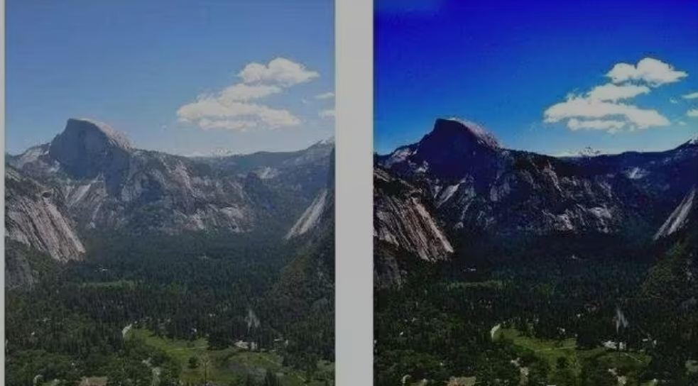
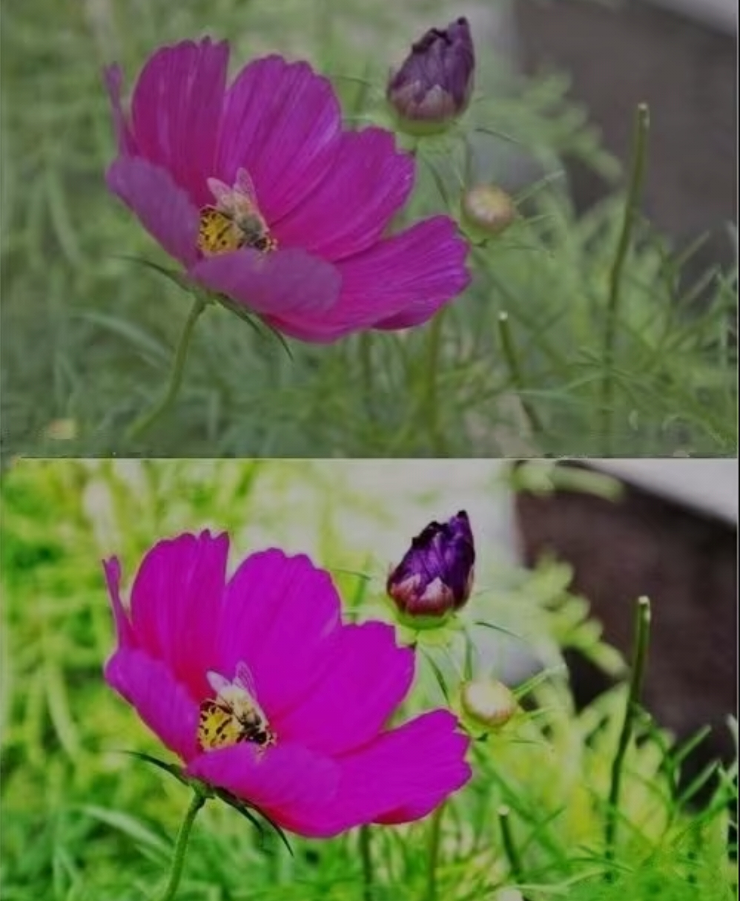
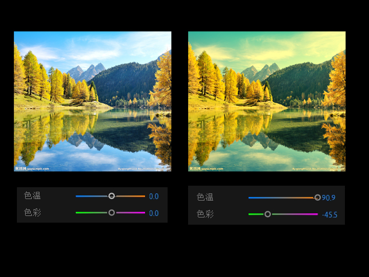
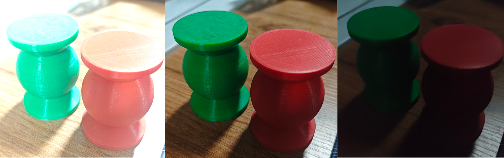
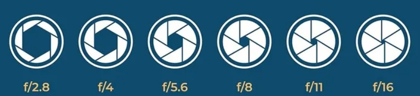
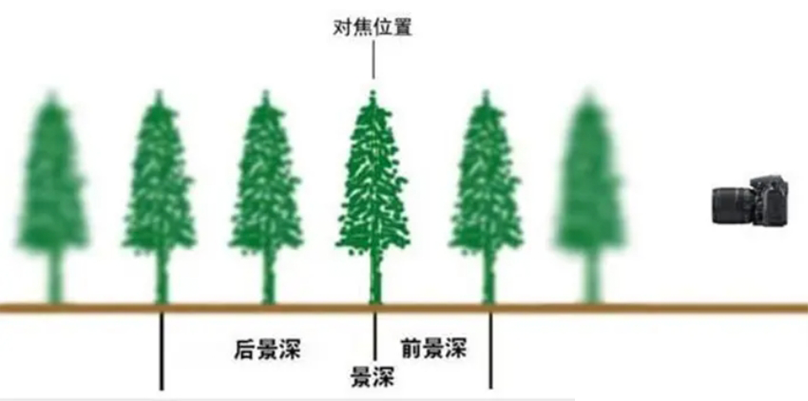
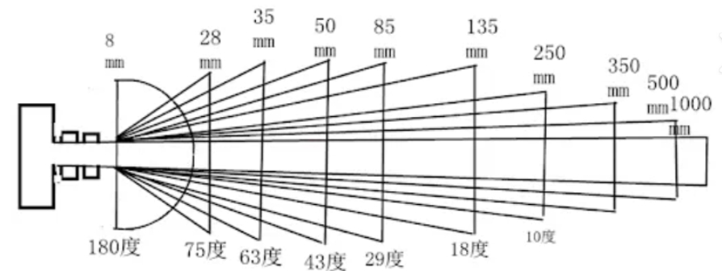
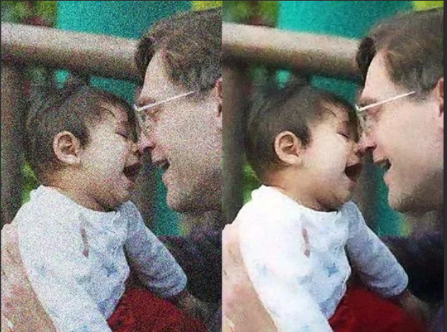
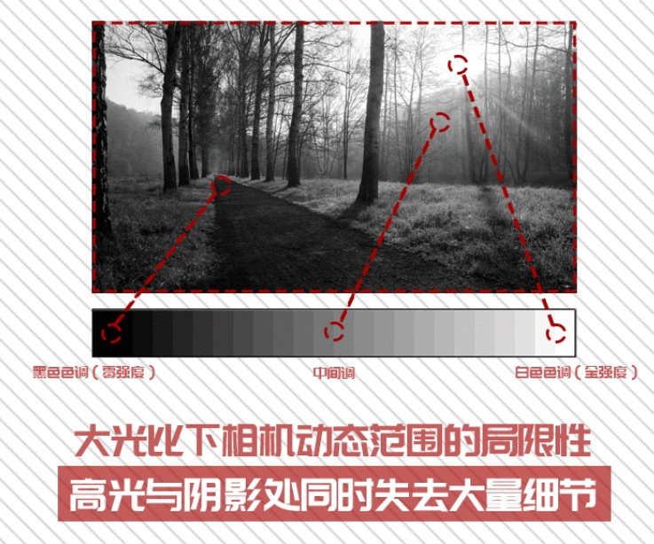
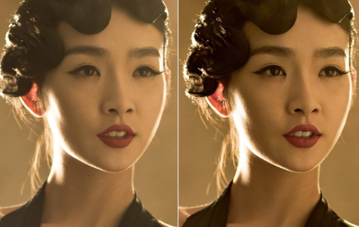

# 相机相关概念

### 一、对比度

------

对比度指的是**一幅图像中明暗区域最亮的白和最暗的黑之间不同亮度层级的测量**，差异范围越大代表对比越大，差异范围越小代表对比越小。
对比度过大，图像就会显得很刺眼。对比度越小，不同颜色之间的反差就越小。

（右图对比度更高）

------

### 二、饱和度

------

饱和度是**色彩的构成要素之一**， 所谓的饱和度,指的其实是色彩的纯度。

**纯度越高,表现越鲜明,**纯度较低，表现则较黯淡；饱和度很低时，图片就会发灰。

(下图饱和度更高)

------

### 三、白平衡

------

白平衡是**白色的平衡程度**，白平衡影响画面的色彩准确度。白平衡不是准确时，会导致画面偏色（如偏红、偏绿）。

一个良好的白平衡可以使图片色彩更加准确，或使画面展现出不同风格的色彩基调（滤镜）。

------

### 四、快门速度与曝光时间

------

#### （一）、快门速度

快门速度是**相机快门关闭的时间**，用来控制相机感光元件（例如数码相机的CMOS或CCD）曝光时间的参数。快门速度通常以秒为单位表示，常见的快门速度包括1/1000秒、1/500秒、1/250秒等。

快门速度直接决定了照片的曝光时间，即相机感光元件暴露于光线下的时间。较快的快门速度会使曝光时间变短，拍摄出的照片会比较暗；较慢的快门速度会使曝光时间变长，拍摄出的照片会比较亮。

快门速度的选择影响到照片中运动物体的清晰度和运动轨迹的呈现。在拍摄运动物体时，需要根据物体的速度和运动轨迹选择合适的快门速度：

快速移动的物体：如果物体运动较快，需要选择较快的快门速度，以减少运动造成的模糊。通常情况下，1/500秒或更快的快门速度可以捕捉到快速移动的物体，并保持图像清晰。

慢速移动的物体：如果物体运动较慢，可以选择较慢的快门速度，以便捕捉到物体的运动轨迹。较慢的快门速度可以呈现出流畅的动态效果，使得照片更加生动。

较快的快门速度可以‘冻结’运动物体，捕捉到瞬间的画面。

#### （二）、曝光时间

曝光时间是**感光元件（例如CMOS或CCD）拍摄时的感光时间**，曝光时间越大，进光量越大。

越长的曝光时间会使画面越亮，一般拍摄的环境越暗，设置的曝光时间越大，选择合适的曝光时间能使画面亮度适中。

------

### 五、光圈

------

光圈是一个**用来控制光线透过镜头，进入机身内感光面进光量**的装置。

光圈大小会有以下几点影响：

1.光线进入相机的量：光圈越大，进入相机的光线越多，照片会更亮；光圈越小，进入相机的光线较少，照片会较暗。

2.像差控制：光圈越小，影像的凝结效果越佳。
通过调整光圈大小，可以根据拍摄场景和需求来调整光线进入相机的量、景深和背景效果，以获得理想的照片效果。

3.景深：光圈越大，景深越小，背景会产生虚化效果；光圈越小，景深越大，背景细节更加清晰。

------

### 六、景深

相机景深是指当相机的镜头对着某一物体**聚焦清晰**时，**在镜头中心所对的位置**垂直镜头轴线的同一平面的点都可以在胶片或者接收器上相当清晰的图像，**在这个平面沿着镜头轴线的前面和后面一定范围**的点也可以结成眼睛可以接受的较清晰的像点，把**这个平面的前面和后面的所有景物的距离**叫做相机的景深。

影响相机景深的主要因素有：

1. 镜头光圈：光圈越大（光圈值f越小），景深越浅；光圈越小（光圈值f越大），景深越深。
2. 主体与镜头距离：距离越远，景深越深；距离越近（不能小于最小拍摄距离），景深越浅。
    在进行拍摄时，可以通过调节相机镜头，使距离相机一定距离的景物清晰成像的过程，叫做对焦，那个景物所在的点，称为对焦点，因为“清晰”并不是一种绝对的概念，所以，对焦点前（靠近相机）、后一定距离内的景物的成像都可以是清晰的，这个前后范围的总和，就叫做景深。
3. 镜头焦距：镜头焦距越长，景深越浅；焦距越短，景深越深。

当景深较浅时（常用拍摄人像）会有一个较为直观的效果：背景虚化。

------

### 七、焦距与焦段

------

#### （一）、焦距

相机焦距是指**从透镜的光心到光聚集之焦点的距离**，通常用于衡量光的聚集或发散程度。

在照相机中，焦距是从镜片中心到底片或CMOS、CCD等成像平面的距离。

焦距的长短决定了被摄物在成像介质（如胶片或CMOS、CCD）上成像的大小、视场角大小、景深大小和画面的透视强弱。

#### （二）、焦段

相机的焦段是指**镜头焦距的划分范围**，主要包括以下几种：
1. 超广角镜头：焦距在17mm至24mm，用来拍摄广阔风景。
2. 广角镜头：焦距在24mm到35mm，适合拍摄较大场景照片，如建筑、集会等。
3. 标准镜头：焦距在45mm至50mm，多用于普通风景、普通人像、抓拍等。
4. 中长焦镜头（人像镜头）：焦距在75mm至200mm，适合拍摄人像、风景、旅游纪念照等。
5. 超长焦镜头：焦距超过200mm以上，适用于拍摄远处的景物。
6. 微距镜头：市面上主流的微距镜头焦距有60mm、90mm、100mm、105mm、150mm、180mm和200mm，用于拍摄十分细微的物体，如花卉及昆虫等。

------

### 八、ISO（感光度）

------

相机的ISO是指**相机的感光度，它衡量相机对光线的敏感程度**。在胶片相机中，不同的胶卷有不同的感光度，而在数码相机中，可以通过调整ISO值来设定相机对光线的敏感程度。

ISO数值越大，表示感光性越强；数值越小，表示感光性越弱。 在光线较暗的情况下，可以提高ISO值来降低快门速度，使照片不那么模糊。但是，较高的ISO值会导致照片颗粒感较强，而较低的ISO值会使画面更细腻。

提升ISO，其实就是的使用电路放大信号的过程，不仅放大了信号，还放大了噪音。噪音的原因其实很好理解，图片中有一种最重要要的噪音是因为光的随机性产生的，称之为光子噪声或者散粒噪声。噪音表现为噪点，所以就会影响画质。

随着ISO的增长，动态范围可能会降低。提升ISO，做提亮处理，画面中的高光部分就会变得更亮，从而可能变为白色，所以这部分细节丢失的可能性就越大，从而使得动态范围降低。

------

### 九、动态范围

------

相机动态范围是指**相机可以捕捉到的亮度范围，从最暗的阴影到最亮的高光**。动态范围通常用EV（曝光值）来表示，EV值越高，相机的动态范围就越大。

相机动态范围对于照片的质量和细节非常重要，较高的动态范围使相机能够在高光和阴影中保留更多的细节，因此更适合在高对比度的场景下拍摄。 

------

### 十、锐度

------

相机的锐度，也被称为清晰度，是**反映图像平面清晰度和图像边缘锐利程度的一个指标**。

如果将锐度调高，图像平面上的细节对比度也更高，看起来更清楚。比如，在高锐度的情况下，画面上人脸的皱纹、斑点更清楚，而且脸部肌肉的鼓起或凹下也可表现得栩栩如生。

然而，并不是将锐度调得越高越好。如果将锐度调得过高，则会在黑线两边出现白色线条的镶边，图像看起来失真而且刺眼。在这种情况下，图像就会显得严重失真，不堪入目。
因此，为了获得相对清晰而又真实的图像，锐度应当调得合适。

------

