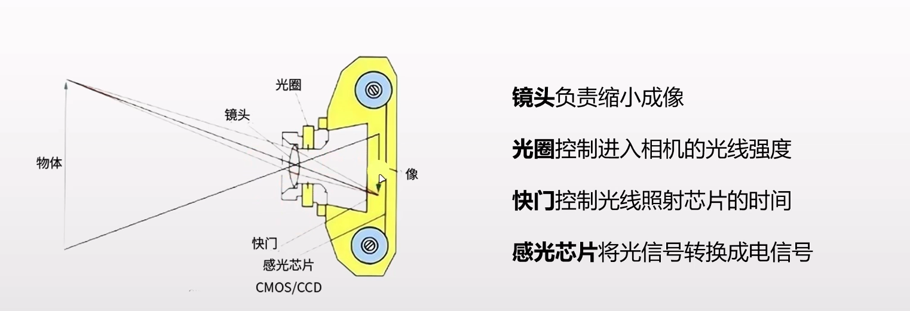
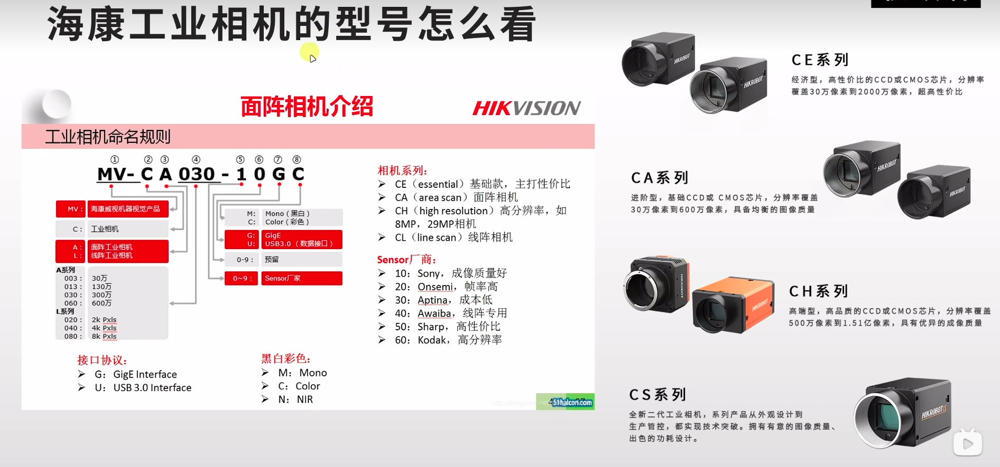

# 一.相机的成像原理

物体反射光线，经过镜头缩小成像在感光芯片上（CMOS / CCD）上

# 二.感光芯片的种类

分为CCD和CMOS	主要区别在于信号的读出过程不同

CMOS每个光电二极管旁都搭建一个放大器，每个放大器在制程都有些微的差异，很难有同步放大的效果，噪声很多
相同尺寸的感光芯片，CMOS的感光度低于CCD
CCD需要外加电压，驱加电荷移动，耗电量高
CMOS集成度高，成本低比CCD便宜
CMOS读取速度比较快，CMOS帧率高于CCD

# 三.快门

分为卷帘快门和全局快门
卷帘快门逐行进行曝光，全局快门同一时间进行曝光
CMOS支持卷帘快门和全局快门，CCD只支持全局快门
全局快门在光电转换后就要等待逐行模数转换读出完成后，才能开始下一帧的拍摄，而且需要更高的处理性能
全局快门要更多的晶体管，会产生较高的背景噪声和更多热量
卷帘快门存在果冻现象

# 四.相机的重要参数

## 1.曝光

光线在感光芯片上的作用强度
曝光 = 通关量×曝光时间×增益
通关量由镜头光圈控制	曝光时间由快门控制

## 2.增益

增益在数码相机中叫做ISO，提高增益，就是提高传感器的感光度
高感光度对光线灵敏，同时对躁杂信号也灵敏，信噪比小，所以高感光度噪点也多
优先使用曝光时间调节图像亮度。在不过曝的前提下，增加曝光时间可以增加信噪比，使图像清晰
对于很弱的信号，曝光时间也不能无限增加，因为随着曝光时间的增加，噪音也会积累
增益的使用场景：高速拍摄场景，增加曝光时间会导致脱影
一般相机增益都产生很大噪音的，所以几乎不怎么用

## 3.分辨率

分辨率指的是感光芯片上像元的数量

eg:
分辨率为3072×2048=6291456	为600万像素网口面阵相机	==还有一种线阵相机有待补充==

分辨率不是越大越好，分辨率太大，对处理性能要求高

## 4.像元尺寸

像元是组成数字图像的最小单元
像元尺寸越大，感光度越高，和分辨率共同决定靶面尺寸的大小
通常工业相机像元尺寸为2um~14um

## 5.像素位深

是指每位像素数据的位数，通常用多少比特位表示
一般，每个像素的比特位数多，表达图像细节的能力强，这个像素的灰阶值更加丰富，分的更细，像素的灰阶深度就更深，但同时数据量也越大，影响系统的图像处理速度，因此也需要慎重选择
常见的是8bit, 10bit, 12bit.分辨率和像素深度共同决定了图像的大小。例如对于像素深度为8bit的500万像素，则整张图片应该有2560×2048×8/8/1024/1024=5MB

## 6.帧率

每秒采集图像的数量，单位为帧数每秒
帧率一般跟曝光时间成反比的关系
相机图像采集过程分为曝光（exposure）和读取(Readout)

相机采集有非重叠模式和重叠模式
非重叠模式：每个图像采集的周期中，相机在下一个图像采集开始前，均要完成曝光、读出整个过程，所以会曝光时间越长，帧率越低
重叠模式 ：允许在下一帧图像开始曝光的时候，将前一帧获得的图像读取并传送出去

## 7.靶面尺寸

感光芯片的尺寸，指的是靶面的对角线的尺寸
由于历史遗留问题，数码相机中的一英寸不等于25.4毫米，而是16毫米

## 8.镜头的安装接口

分为螺纹接口和卡口
螺纹接口：C、CS、M12、M42、M58	C和CS是机器视觉领域应用最广泛的镜头接口	C接口的镜头加一个接圈可以加到CS接口的相机上，但是CS接口的镜头永远没办法用在C接口的相机上面

## 9.输出接口

常见接口有网口，USB口和Camera Link

## 10.白平衡

由于光敏元件在不同的光照条件下RGB三个分量的输出是不平衡的，从而会产生图像在色彩上的失真，偏蓝或者偏红，因此需要白平衡来还原图像的色彩。通常相机完成白平衡可以分为自动和手动白平衡两种，此外还可以通过软件实现白平衡

# 五.工业镜头的选型要点

## 要点一

镜头靶面尺寸要大于等于相机CCD的靶面尺寸，否则成像有黑边
## 要点二

镜头的接口和相机接口匹配，C镜头可通过转接口安装到CS相机，CS相机无法安装到C接口相机

## 要点三

计算正确的焦距

### 镜头焦距的计算

高斯光学公式：1/u + 1/v = 1/f
在实际中物距u远大于像距v，所以1/u远小于1/v
故高斯光学公式近似为1/v = 1/f。 工程实践中么，焦距一般等效为像距  f = v

1.知道CCD尺寸、物距、物体大小（观察范围）
解法：焦距 = （物距×CCD尺寸）/ 物体大小

eg:
已知客户观察范围为50mm×50mm，工作距离为150mm，CCD尺寸为1/1.8'',请问使用什么焦距的镜头合适？

解：
		客户的CCD靶面尺寸为1/1.8''，查表可得尺寸为7.2×5.4mm
		焦距 = （物距×CCD尺寸）/ 物体大小
				=150×5.4/50		==为什么不使用7.2？==
				=16.2mm
所以可选择焦距为16mm左右的工业镜头

2.知道线放大倍数M，和工作距离L
公式推导：M = 像宽/物宽=v/u，带入高斯光学公式
可推导出公式：f =L×M / (M+1)

最后附上海康工业相机的型号

相关文档：https://blog.csdn.net/qq_27923041/article/details/106858708

完成于2023.7.17日，有待补充完善

