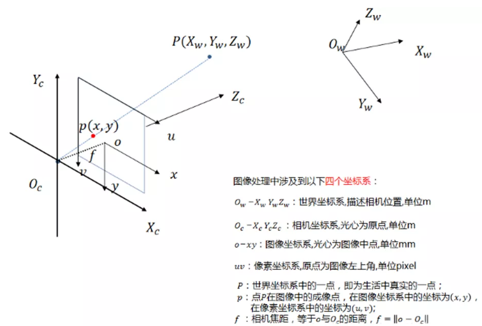
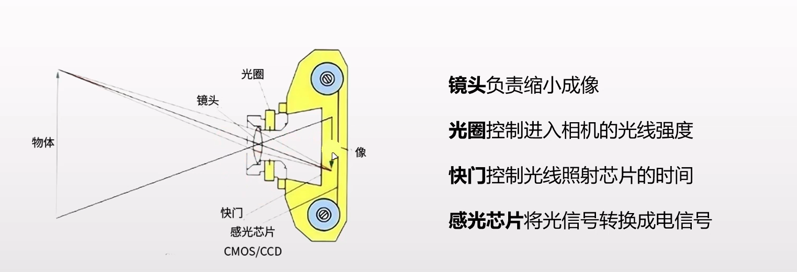

# ***视觉的核心——相机*** 介绍

## 零、相机的作用与注意事项

相机作为视觉组的核心，它的作用就是获取周围物体的光学信息，用于识别环境与要击打的目标。想要**准确识别目标并预测其运动**，选择一个参数合适的相机是必不可少的；

了解*相机成像原理*、理解调整曝光等*相机参数*以获得清晰完整的画面、学习*相机标定*，了解坐标变换并解算目标坐标，是实现**精确识别并解算坐标**的基础。

------

## 一、相机的成像原理

物体反射光线，经过镜头缩小成像在感光芯片上（CMOS / CCD）上

下面将依次介绍**镜头、光圈、快门、感光芯片**对图片的影响。

###    （一）镜头的影响

#### 		1. 焦距与焦段

##### 				① 焦距

​					相机焦距是指**从透镜的光心到光聚集之焦点的距离**，通常用于衡量光的聚集或发散程度。

​					在相机中，焦距是从镜片中心到底片或CMOS、CCD 等成像平面的距离。

​					焦距的长短决定了被摄物在成像介质（如胶片或CMOS、CCD）上成像的大小、视场角大小、景深大小和画面的透视强弱。

##### 				② 焦段（了解即可）

​					相机的焦段是指**镜头焦距的划分范围**，主要包括以下几种：

1. 超广角镜头：焦距在17 mm至24 mm，用来拍摄广阔风景。

2. 广角镜头：焦距在24 mm到35 mm，适合拍摄较大场景照片，如建筑、集会等。

3. 标准镜头：焦距在45 mm至50 mm，多用于普通风景、普通人像、抓拍等。

4. 中长焦镜头（人像镜头）：焦距在75 mm至200 mm，适合拍摄人像、风景、旅游纪念照等。

5. 超长焦镜头：焦距超过200 mm以上，适用于拍摄远处的景物。

6. 微距镜头：市面上主流的微距镜头焦距有60 mm、90 mm、100 mm、105 mm、150 mm、180 mm和200 mm，用于拍摄十分细微的物体，如花卉及昆虫等。

   

   ### （二）光圈的影响

   ​		光圈是一个**用来控制光线透过镜头，进入机身内感光面进光量**的装置。

   ​		光圈大小会有以下几点影响：

   ​		1.光线进入相机的量：光圈越大，进入相机的光线越多，照片会更亮；光圈越小，进入相机的光线较少，照片会较暗。

   ​		2.像差控制：光圈越小，影像的凝结效果越佳。
   ​			通过调整光圈大小，可以根据拍摄场景和需求来调整光线进入相机的量、景深和背景效果，以获得理想的照片效果。

   ​		3.景深：光圈越大，景深越小，背景会产生虚化效果；光圈越小，景深越大，背景细节更加清晰。

   

   

   

   #### 		景深（了解即可）

   ​					相机景深是指当相机的镜头对着某一物体**聚焦清晰**时，**在镜头中心所对的位置**垂直镜头轴线的同一平面的点都可以在胶片或者接收器上相当清晰的图像，**在这个平面沿着镜头轴线的前面和后面一定范围**的点也可以结成眼睛可以接受的较清晰的像点，把**这个平面的前面和后面的所有景物的距离**叫做相机的景深。

   ​			影响相机景深的主要因素有：

   1. 镜头光圈：光圈越大（光圈值f越小），景深越浅；光圈越小（光圈值f越大），景深越深。

   2. 主体与镜头距离：距离越远，景深越深；距离越近（不能小于最小拍摄距离），景深越浅。
      在进行拍摄时，可以通过调节相机镜头，使距离相机一定距离的景物清晰成像的过程，叫做对焦，那个景物所在的点，称为对焦点，因为“清晰”并不是一种绝对的概念，所以，对焦点前（靠近相机）、后一定距离内的景物的成像都可以是清晰的，这个前后范围的总和，就叫做景深。

   3. 镜头焦距：镜头焦距越长，景深越浅；焦距越短，景深越深。

      ​	当景深较浅时（常用拍摄人像）会有一个较为直观的效果：背景虚化。

   

   

   ​		在视觉组的应用中，肯定是了解到的信息越多越好，景深够深，前后成像才能清晰。

   ### （三）快门的影响

   快门分为**卷帘快门**和**全局快门**
   卷帘快门逐行进行曝光，全局快门同一时间进行曝光
   CMOS支持卷帘快门和全局快门，CCD只支持全局快门
   全局快门在光电转换后就要等待逐行模数转换读出完成后，才能开始下一帧的拍摄，而且需要更高的处理性能
   全局快门要更多的晶体管，会产生较高的背景噪声和更多热量
   卷帘快门存在**果冻现象**

   

   #### 		1. 快门速度

   快门速度是**相机快门关闭的时间**，用来控制相机感光元件（例如数码相机的CMOS或CCD）曝光时间的参数。快门速度通常以秒为单位表示，常见的快门速度包括1/1000秒、1/500秒、1/250秒等。

   快门速度直接决定了照片的曝光时间，即相机感光元件暴露于光线下的时间。较快的快门速度会使曝光时间变短，拍摄出的照片会比较暗；较慢的快门速度会使曝光时间变长，拍摄出的照片会比较亮。

   快门速度的选择影响到照片中运动物体的清晰度和运动轨迹的呈现。在拍摄运动物体时，需要根据物体的速度和运动轨迹选择合适的快门速度：

   快速移动的物体：**如果物体运动较快，需要选择较快的快门速度**，以减少运动造成的模糊。通常情况下，1/500秒或更快的快门速度可以捕捉到快速移动的物体，并**保持图像清晰**。

   慢速移动的物体：如果物体运动较慢，可以选择较慢的快门速度，以便捕捉到物体的运动轨迹。较慢的快门速度可以呈现出流畅的动态效果，使得照片更加生动。

   较快的快门速度可以‘冻结’运动物体，捕捉到瞬间的画面。

   #### 		2.曝光时间

   曝光时间是**感光元件（例如CMOS或CCD）拍摄时的感光时间**，曝光时间越大，进光量越大。

   越长的曝光时间会使画面越亮，一般拍摄的环境越暗，设置的曝光时间越大，选择合适的曝光时间能使画面亮度适中。

   

   

   ### （四）感光芯片（了解即可）

   #### 		1. 感光芯片的种类

   ​			分为CCD和CMOS	主要区别在于信号的读出过程不同

   

       

   

   CMOS每个光电二极管旁都搭建一个放大器，每个放大器在制程都有些微的差异，很难有同步放大的效果，噪声很多
   相同尺寸的感光芯片，CMOS的感光度低于CCD
   CCD需要外加电压，驱加电荷移动，耗电量高
   CMOS集成度高，成本低比CCD便宜
   CMOS读取速度比较快，CMOS帧率高于CCD

   

   

   ------

   

## 二、相机的其他重要参数

### 	1. 曝光

​	光线在感光芯片上的作用强度
​	曝光 = 通光量 × 曝光时间 × 增益
​	通光量由镜头、光圈控制；曝光时间由快门控制。

### 	2. ISO（了解即可）

​	相机的ISO是指**相机的感光度，它衡量相机对光线的敏感程度**。在胶片相机中，不同的胶卷有不同的感光度，而在数码相机中，可以通过调整ISO（**增益**）值来设定相机对光线的敏感程度。

​	ISO数值越大，表示感光性越强；数值越小，表示感光性越弱。高感光度对光线灵敏，同时对躁杂信号也灵敏，信噪比小，所以高感光度噪点也多。 在光线较暗的情况下，可以提高ISO值来降低快门速度，使照片不那么模糊。但是，较高的ISO值会导致照片颗粒感较强，而较低的ISO值会使画面更细腻。

​	提升ISO，其实就是的使用电路放大信号的过程，不仅放大了信号，还放大了噪音。噪音的原因其实很好理解，图片中有一种最重要要的噪音是因为光的随机性产生的，称之为光子噪声或者散粒噪声。噪音表现为噪点，所以就会影响画质。

​	优先使用曝光时间调节图像亮度。在不过曝的前提下，增加曝光时间可以增加信噪比，使图像清晰；
​	对于很弱的信号，曝光时间也不能无限增加，因为随着曝光时间的增加，噪音也会积累。

### 	3. 分辨率

​	分辨率指的是感光芯片上像元的数量

​	例如：
​		分辨率为3072 × 2048  = 6291456	—— 600万像素网口面阵相机

​	一般来说分辨率越高，图像越清晰，但分辨率不是越大越好，分辨率太大，对处理性能要求高。

​	（ 还有一种线阵相机感兴趣的可以了解一下https://zhuanlan.zhihu.com/p/565814130 ）

### 	4. 像元尺寸

​		像元是组成数字图像的最小单元
​		像元尺寸越大，感光度越高，和分辨率共同决定靶面尺寸的大小
​		通常工业相机像元尺寸为2 um ~ 14 um

### 	5. 像素位深

​		是指每位像素数据的位数，通常用多少比特位表示。

​		一般每个像素的比特位数越多，表达图像细节的能力越强，这个像素的灰阶值更加丰富，分的更细，像素的灰阶深度就更深，但同时数据量也越大，影响系统的图像处理速度，因此也需要慎重选择。
​		常见的是8 bit, 10 bit, 12 bit 。分辨率和像素深度共同决定了图像的大小。例如对于像素深度为8 bit的 500 万像素，则整张图片应该有2560×2048×8/8/1024/1024 = 5 MB 

​		当然实际8 bit 没这么明显：）

### 	6. 帧率

​		每秒采集图像的数量，单位为帧数每秒。帧率一般跟曝光时间成反比
​		相机图像采集过程分为曝光（exposure）和读取(Readout)

​		相机采集有**非重叠模式**和**重叠模式**
​			非重叠模式：每个图像采集的周期中，相机在下一个图像采集开始前，均要完成曝光、读出整个过程，所以会曝光时间越长，帧率越低
​			重叠模式 ：允许在下一帧图像开始曝光的时候，将前一帧获得的图像读取并传送出去

### 	7. 靶面尺寸

​		感光芯片的尺寸，指的是靶面的对角线的尺寸
​		由于历史遗留问题，数码相机中的一英寸不等于25.4毫米，而是16毫米

### 	8. 镜头的安装接口

​		分为螺纹接口和卡口
​		螺纹接口：C、CS、M12、M42、M58	C和CS是机器视觉领域应用最广泛的镜头接口	C接口的镜头加一个接圈可以加到CS接口的相机上，但是CS接口的镜头永远没办法用在C接口的相机上面

### 	9. 输出接口

​		常见接口有网口，USB口和Camera Link

### 	10. 白平衡

​		由于光敏元件（CMOS、CCD等）在不同的光照条件下 R G B 三个分量的输出是不平衡的，从而会产生图像在色彩上的失真，偏蓝或者偏红，因此需要白平衡来还原图像的色彩。通常相机完成白平衡可以分为自动和手动白平衡两种，有些相机还配有可输出的白平衡传感器（log模式），可以通过软件实现白平衡.

​		一个良好的白平衡可以使图片色彩更加准确，或使画面展现出不同风格的色彩基调（滤镜）。

### 	11. 动态范围

相机动态范围是指**相机可以捕捉到的亮度范围，从最暗的阴影到最亮的高光**。动态范围通常用EV（曝光值）来表示，EV值越高，相机的动态范围就越大。

相机动态范围对于照片的质量和细节非常重要，较高的动态范围使相机能够在高光和阴影中保留更多的细节，因此更适合在高对比度的场景下拍摄。 

在实际比赛中，场地的灯光、装甲板的灯条等发光物体与地板、墙壁等不发光的物体的亮度差距可能会很大，如果动态范围不够，就会失去部分细节（比如装甲板过亮在图像中显示为白色（255， 255， 255），会给颜色识别造成麻烦。）

------

## 三、相机与镜头选型

### 	1. 通信接口

- USB (2.0 3.0)
  - 传输较快
- GigE(网口)
  - 网络传输，可进行较远距离传输
- CameraLink
  - E价格贵
  - 性能好

一般选USB，帧率高，比赛中也不需要与PC远距离传输数据

### 	2. 镜头接口

- C口

- CS口

  C和CS是机器视觉领域应用最广泛的镜头接口	C接口的镜头加一个接圈可以加到CS接口的相机上，但是CS接口的镜头永远没办法用在C接口的相机上面

所以一般选 C口

### 	3. 感光芯片

重要参数:

- 芯片尺寸(1、1/3、2/3英寸)
- 芯片类型(CMOS/CCD) (一般为CMOS)
- 水平/垂直分辨率
- 感光芯片尺寸
- 黑/彩色

### 	4. 其他参数

- 拍摄触发方式

  - 软件
  - 高低电平(速度较快)
  - ...

- 帧率(重要)

- 配套镜头焦距计算

- 高斯光学公式：1/u + 1/v = 1/f
  在实际中物距u远大于像距v，所以1/u远小于1/v
  故高斯光学公式近似为1/v = 1/f。 工程实践中么，焦距一般等效为像距  f = v

  1. 知道CCD尺寸、物距、物体大小（观察范围）
     解法：焦距 = （物距 × CCD尺寸）/ 物体大小

  例如 :
  已知客户观察范围为50 mm × 50 mm，工作距离为150 mm，CCD尺寸为1/1.8'',请问使用什么焦距的镜头合适？

  解：
  		客户的CCD靶面尺寸为1/1.8''，查表可得尺寸为7.2 × 5.4 mm
  		焦距 = （物距×CCD尺寸）/ 物体大小
  				=150×5.4/50		==为什么不使用7.2？==
  				=16.2 mm
  所以可选择焦距为16 mm左右的工业镜头

  2. 知道线放大倍数M，和工作距离L
     公式推导：M = 像宽/物宽=v/u，带入高斯光学公式
     可推导出公式：f =L×M / (M+1)

### 	5. 如何选型

- **彩色**/黑白
- **USB**/GigE/CameraLink
- 镜头: **C**/CS
- 帧率: 比赛中一般选高帧率, 相机理论帧率200往上(一般像素高的帧率就低)
- 分辨率

### 	6. 常见工业相机

- 海康(Hik)

  ## 

  - [客户端(驱动)下载](https://www.hikrobotics.com/cn/machinevision/service/download?module=0)

- 大恒(daheng)

  - [客户端(驱动)下载](https://www.daheng-imaging.com/downloads/softwares/)

- 迈德威视(Mind Vision)

  - [客户端(驱动)下载](https://www.mindvision.com.cn/category/software/)

- ...

  ------

  

相关文档：https://blog.csdn.net/qq_27923041/article/details/106858708

完成于2024.4.28日，有待进一步补充完善。