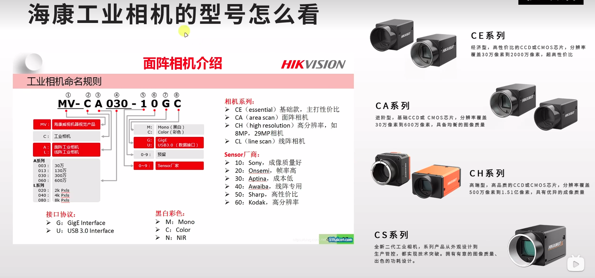

# 一. 相机选型

## 1.1 通信接口

- USB (2.0 3.0)
  - 传输较快
- GigE(网口)
  - 网络传输，可进行较远距离传输
- CameraLink
  - E价格贵
  - 性能好

一般选USB，帧率高，比赛中也不需要与PC远距离传输数据

## 1.2 镜头接口

- C口
- CS口

一般选 C口

## 1.3 感光芯片

重要参数:

- 芯片尺寸(1、1/3、2/3英寸)
- 芯片类型(CMOS/CCD) (一般为CMOS)
- 水平/垂直分辨率
- 感光芯片尺寸
- 黑/彩色

## 1.4 其他参数

- 拍摄触发方式
  - 软件
  - 高低电平(速度较快)
  - ...
- 帧率(重要)

## 1.5 如何选型

- **彩色**/黑白
- **USB**/GigE/CameraLink
- 镜头: **C**/CS
- 帧率: 比赛中一般选高帧率, 相机理论帧率200往上(一般像素高的帧率就低)
- 分辨率

# 二. 常见工业相机

- 海康(Hik)
  - [客户端(驱动)下载](https://www.hikrobotics.com/cn/machinevision/service/download?module=0)
- 大恒(daheng)
  - [客户端(驱动)下载](https://www.daheng-imaging.com/downloads/softwares/)
- 迈德威视(Mind Vision)
  - [客户端(驱动)下载](https://www.mindvision.com.cn/category/software/)
- ...

# 附录

## 海康相机选型

