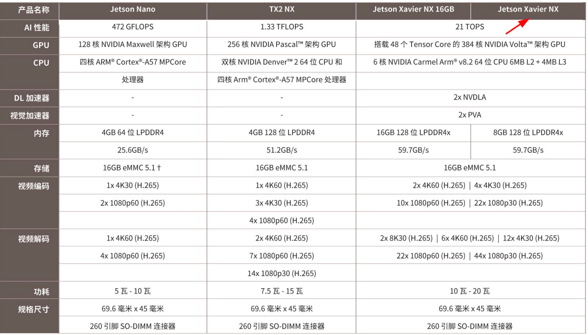
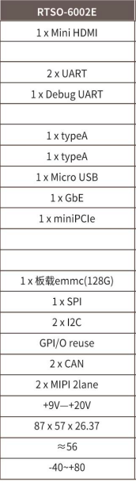
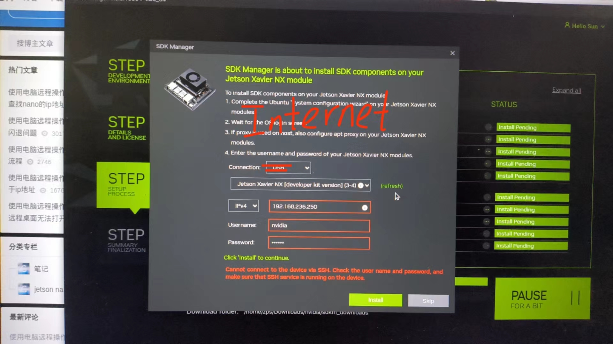

# Jetson刷机指南

Jetson 系统监视程序Jtop
https://www.jianshu.com/p/497a9f6e34fd


序：目前队里的jetson型号为Xavier NX(显存8GB),一共四个（RM2个，RC两个)，均购于瑞泰新时代公司,搭载6002E载板（第三方开发套件）





瑞泰官网: https://realtimes.cn/   

云盘访问密码为: realtimes2022


NVIDIA 的 Jetson 系列是一系列高性能嵌入式计算平台，旨在用于构建机器学习、深度学习和计算机视觉应用程序。Jetson 平台具有强大的 GPU 和 CPU，使其能够在边缘设备上进行高性能的 AI 推断和数据处理。Jetson 系列平台通常使用 NVIDIA 的深度学习加速库 cuDNN 和 CUDA，使其能够在硬件级别加速深度学习任务。它们还提供了丰富的软件支持，包括 JetPack SDK，其中包括了 TensorRT、OpenCV 和各种 AI 模型。

## 1.环境烧录

参考  Xavier_NX系统烧录说明手册，位于帮助文档->中文->Jetson烧录与备份

```sh	
sudo tar -vxf Jetson_Linux_R35.3.1_aarch64.tbz2
cd Linux_for_Tegra/rootfs/
sudo tar -jxpf ../../Tegra_Linux_Sample-Root-Filesystem_R35.3.1_aarch64.tbz2 
cd ../..
sudo tar -vxf Realtimes_L4T_R35.3.1_rtso-6002_xavier-nx_20230419.tbz2
cd Realtimes_L4T_R35.3.1_rtso-6002/
sudo ./install.sh # sudo apt-get install qemu-user-static
# 使nx进入recovery模式
lsusb
cd ../Linux_for_Tegra/
sudo ./flash.sh rtso-6002e-v1.2 mmcblk0p1 # 对于rtso-***   ls看载板名去掉.conf
```


注意事项：1.服务器主机（即你的笔记本电脑）：不限于官方文档给的16.04和18.04，Ubuntu别的系统也可以进行烧录，我用的20.04也可以进行烧录
				  2.推荐烧录的系统为3531,一共需要三个软件包，结合烧录说明手册在官方网站里都可以找到
				  3.进入recovery模式的方法：首先供电口对着自己，连上适配器，接着马上按住中间的按钮，按三秒后，按一下左边的按钮，按一下后松开，期间中间的按钮不要松，直到按完左边的按钮两秒后再松开（如果进不去别着急，多试几次或者是因为线的问题可以换一根microusb线）
之后的烧录环境步骤参考文档或视频就行，很详细，没有什么注意事项，出现小问题的话搜一下应该就能解决，视频网址：https://www.bilibili.com/video/BV1D14y1m7nG/?spm_id_from=333.999.0.0&vd_source=d9f539810e996eac76f619a3a7c90193


## 2.设置从EMMC卡启动系统

视频教程：https://www.bilibili.com/video/BV1gr4y1R789/

在烧录完环境后，根目录的内存很小，所以要设置从EMMC卡启动系统
按照文档操作会有问题，所以给出视频教程：https://www.bilibili.com/video/BV1gr4y1R789/?spm_id_from=333.999.0.0&vd_source=d9f539810e996eac76f619a3a7c90193

以及操作步骤

```sh
# 以下在nx上
sudo parted /dev/mmcblk1 mklabel gpt
sudo parted /dev/mmcblk1 mkpart primary 0GB 115GB
sudo mkfs.ext4 /dev/mmcblk1p1
# 如果从U盘下载，则将下一句替换为  sudo dd if =/U盘名称/img/6002emmc.img.raw of=/dev/mmcblk1p1 bs=1M
sudo dd if=/dev/mmcblk0p1 of=/dev/mmcblk1p1 bs=1M

sudo fsck /dev/mmcblk1p1

sudo resize2fs /dev/mmcblk1p1
sudo blkid /dev/mmcblk1p1 # 查看分区的 PARTUUID 值

# 以下在PC端
sudo echo 'PARTUUID 值'
sudo cat bootloader/l4t-rootfs-uuid.txt_ext

# 使nx进入recovery模式 
sudo ./flash.sh rtso-6002e-v1.2 external
```

注意：1.在向 l4t-rootfs-uuid.txt 写入 PARTUUID 的值时
即  **echo ‘64248bb5-57c3-4d96-8e6e-93a6b5ce815a’ > bootloader/l4t-rootfs-uuid.txt_ext** 不要tab键自动补全，否则l4t-rootfs-uuid.txt_ext会自动补全成下划线


## 3.Jetpack安装

[sdkmanager下载网址](https://developer.nvidia.com/sdk-manager)

注意事项：

- 在安装jetpack之前要先确定Xavier设备L4T系统版本与jetpack版本的对应关系

- 在往jetson上烧录的时候Connection要选择Internet，见下图

注意事项：1.先进行换源
                  2.在安装jetpack之前要先确定Xavier设备L4T系统版本与jetpack版本的对应关系
				  3.在往jetson上烧录的时候Connection要选择Internet，见下图



## 4.Opencv和Qt的安装

参考  Jetson安装`opencv4.5.1`和`QT5`方法配置`vnc`和中文输入法.pdf，位于帮助文档->中文->Jetson系统软件配置

 aptopencv软件包位于`AT-Docs/src/hardware/jetson/software_package/jetson_opencv
## 5.另一种装法
最近不知道什么原因用jetpack烧录cuda老是寄，用最直接的方法来下载
sudo apt install nvidia-jetpack
sudo vim ~/.bashrc
export PATH=/usr/local/cuda/bin:$PATH
export LD_LIBRARY_PATH=/usr/local/cuda/lib64:$LD_LIBRARY_PATH
更新一下环境安装jetson-stats
sudo -H pip3 install jetson-stats
sudo jtop #之后就可以查看自己的jetpack以及cuda的配置
默认的opencv是不可以使用cuda加速的需要卸载重新安装
参考   https://blog.csdn.net/ayxc_ve/article/details/134181991
建议opencv仍按照队库的方法安装
